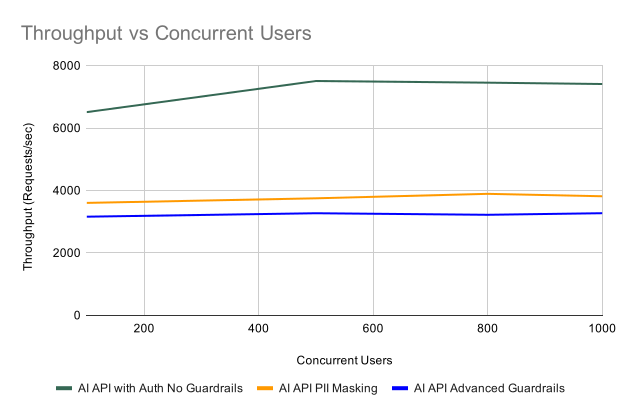
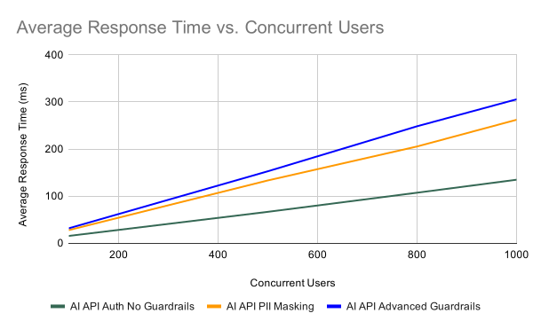
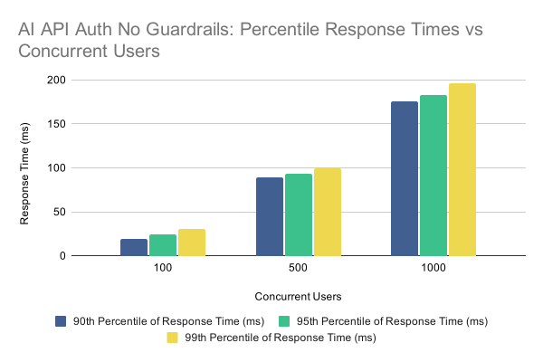
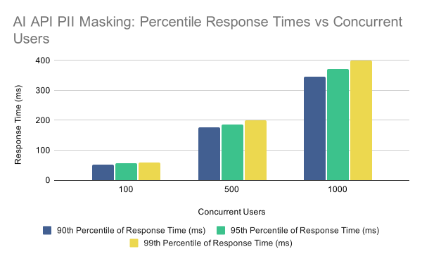
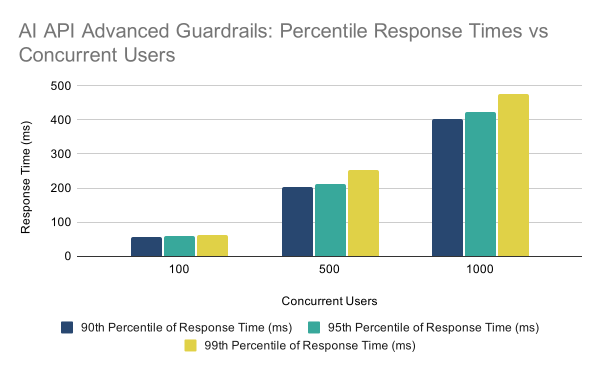

# AI Gateway runtime with four CPUs

The table below displays the resource allocations for the AI Gateway components used in the performance tests.

| Component          | CPU | Memory | Router Concurrency | GOMAXPROCS |
| ------------------ | --- | ------ | ------------------ | ---------- |
| Gateway Controller | 1   | 2 GB   | —                  | —          |
| Gateway Runtime    | 4   | 2 GB   | 4                  | 4          |

## Throughput (requests/sec) vs. concurrent users

The graph below shows how AI Gateway throughput changes as concurrent users increase for AI API Auth No Guardrails, AI API PII Masking, and AI API Advanced Guardrails.

{ width="900" }

**Key observations:**

- The four-CPU gateway runtime supports higher overall request rates than the two-CPU configuration under comparable load.
- The lower relative throughput observed in AI API PII Masking and AI API Advanced Guardrails scenarios is attributable to the additional request and response processing carried out by the gateway around the backend call.
- Throughput for each scenario rises from low concurrency and then levels off toward higher concurrent-user counts.

## Average response time (ms) vs. concurrent users

The graph below shows how average response time changes for the same AI API scenarios as concurrent users increase. The backend delay was configured to 10 ms for these tests.

{ width="900" }

**Key observations:**

- The four-CPU configuration improves response times compared with the two-CPU results under comparable load.
- AI API PII Masking takes longer than Auth No Guardrails because the gateway processes and masks data in both requests and responses.

## Response time percentiles vs. concurrent users

The graphs below show the 90th, 95th, and 99th percentile response times at 10 ms backend delay. Percentile values indicate the response time below which that percentage of requests completed, for example, the 99th percentile is the response time exceeded by only 1% of requests.

{ width="900" }

**Key observations:**

- 90th, 95th, and 99th percentile response times increase as concurrent users grow.
- The four-CPU configuration yields lower percentile values at high concurrency than the two-CPU configuration.
- Percentile growth mainly reflects load on the gateway and the fixed backend delay, without content-level guardrail processing.

{ width="900" }

**Key observations:**

- Percentile trends follow the same upward pattern as concurrent users increase across the test range.
- Compared with Auth No Guardrails, percentile values are higher at each concurrency level due to request and response masking.
- Compared with the two-CPU PII Masking results, the four-CPU configuration keeps percentiles lower under similar concurrency.

{ width="900" }

**Key observations:**

- Percentile trends follow the same upward pattern as concurrent users increase across the test range.
- Compared with the two-CPU Advanced Guardrails results, the four-CPU configuration improves percentile response times at high concurrency.

Test scenario results in CSV format are available [here](https://raw.githubusercontent.com/wso2/api-platform/refs/heads/main/gateway/perf/ai-gateway-1.1.0-perf-test-results/4-core-results-summary.csv).
