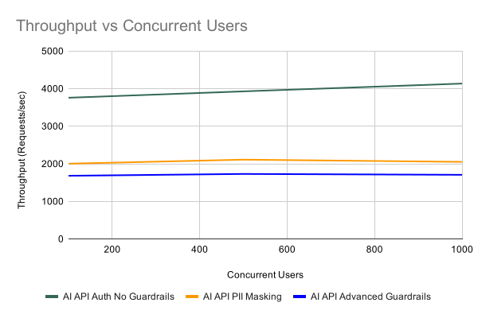
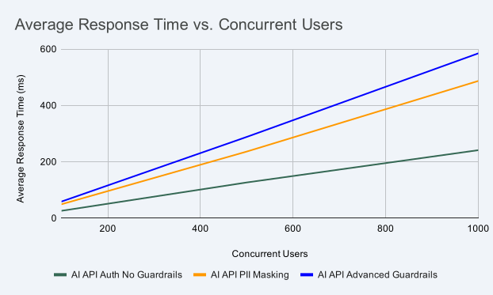
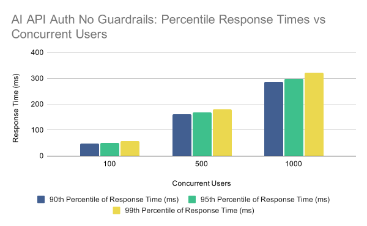
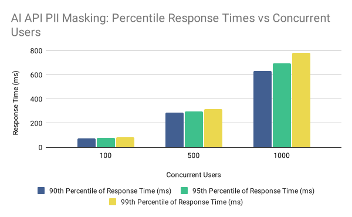
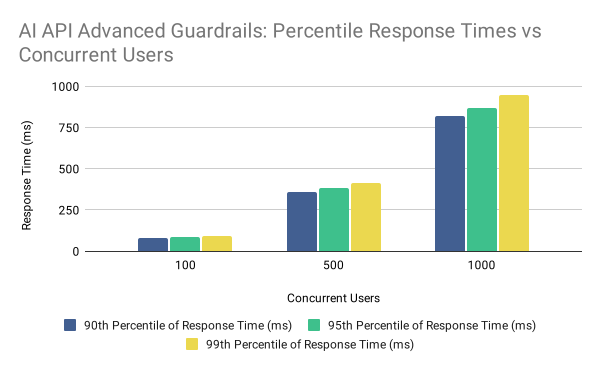

# AI Gateway runtime with two CPUs

The table below displays the resource allocations for the AI Gateway components used in the performance tests.

| Component          | CPU | Memory | Router Concurrency | GOMAXPROCS |
| ------------------ | --- | ------ | ------------------ | ---------- |
| Gateway Controller | 1   | 2 GB   | —                  | —          |
| Gateway Runtime    | 2   | 2 GB   | 2                  | 2          |

## Throughput (requests/sec) vs. concurrent users

The graph below shows how AI Gateway throughput changes as concurrent users increase for AI API Auth No Guardrails, AI API PII Masking, and AI API Advanced Guardrails.

{ width="900" }

**Key observations:**

- Throughput for each scenario remains in a consistent range as concurrent users increase.
- AI API PII Masking and AI API Advanced Guardrails exhibit lower relative throughput because the gateway performs additional request and response processing, both before forwarding requests to the backend and after receiving responses.

## Average response time (ms) vs. concurrent users

The graph below shows how average response time changes for the same AI API scenarios as concurrent users increase. The backend delay was configured to 10 ms for these tests.

{ width="900" }

**Key observations:**

- Average response time increases as concurrent users grow due to resource contention on the gateway runtime.
- AI API PII Masking takes longer than Auth No Guardrails because the gateway performs additional processing to identify and mask data in both requests and responses

## Response time percentiles vs. concurrent users

The graphs below show the 90th, 95th, and 99th percentile response times at 10 ms backend delay. Percentile values indicate the response time below which that percentage of requests completed, for example, the 99th percentile is the response time exceeded by only 1% of requests.

{ width="900" }

**Key observations:**

- 90th, 95th, and 99th percentile response times increase as concurrent users grow.
- Higher concurrency widens the spread between lower and upper percentiles.
- Because this scenario uses API key authentication without content guardrails, percentile growth mainly reflects gateway load and the backend delay.

{ width="900" }

**Key observations:**

- Percentile trends follow the same upward pattern as concurrent users increase across the test range.
- Compared with Auth No Guardrails, percentile values sit higher at each concurrency level because of message inspection and masking.

{ width="900" }

**Key observations:**

- Percentile trends follow the same upward pattern as concurrent users increase across the test range.
- Compared with PII Masking alone, Advanced Guardrails shows higher relative percentiles due to the extra validation steps.

Test scenario results in CSV format are available [here](https://raw.githubusercontent.com/wso2/api-platform/refs/heads/main/gateway/perf/ai-gateway-1.1.0-perf-test-results/2-core-results-summary.csv).
