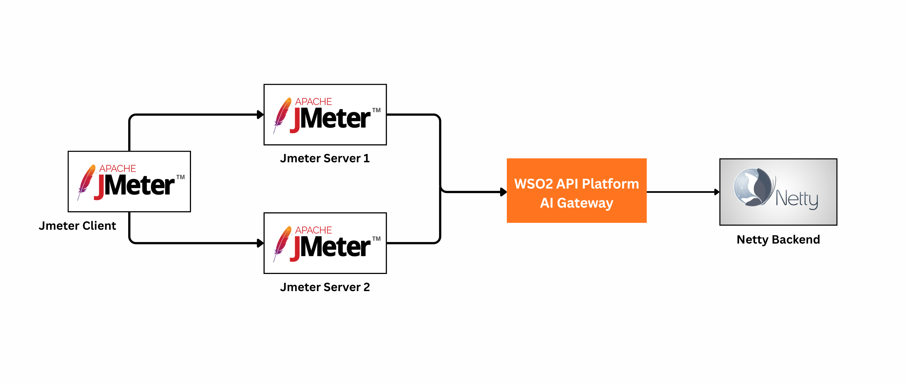

# API Platform AI Gateway Performance

The performance of the WSO2 API Platform AI Gateway was evaluated using the following APIs, all of which invoke a simple Netty HTTP Echo Service as the backend. The Netty-based backend echoes each request after a configurable delay and with a configurable response size, simulating an LLM provider invocation.

- **AI API Auth No Guardrails**: AI API invocation through the AI Gateway with API key authentication enabled and no guardrails applied.
- **AI API PII Masking**: AI API invocation through the AI Gateway with API key authentication and PII masking enabled for both requests and responses.
- **AI API Advanced Guardrails**: AI API invocation through the AI Gateway with API key authentication, request and response PII masking, and URL and JSON schema guardrails enabled.

The performance tests were conducted with 100, 500, and 1000 concurrent users, where concurrent users represent multiple clients accessing the AI Gateway simultaneously. The backend response delay was configured to 10 ms, and the backend response size was set to 10 KiB. Each request used a payload size of 1 KiB.

Apache JMeter was used as the test client. Each test scenario was executed for 15 minutes, including a 3-minute warm-up period. Performance metrics were calculated after excluding the warm-up period from the analysis.

The following key metrics were used to evaluate AI Gateway performance:

- **Throughput**: The number of requests processed by the AI Gateway per unit of time (requests per second).
- **Response time**: The end-to-end time taken to process a request. The complete response time distribution, including the 90th, 95th, and 99th percentile response times, was recorded and analyzed.

## Deployment used for the test

The diagram below shows the deployment architecture used for the performance tests documented here.

{ width="900" }

| Component                    | EC2 Instance Type | vCPU | Memory (GiB) |
| ---------------------------- | ----------------- | :--: | :----------: |
| Apache JMeter Client         | `c5.2xlarge`      |   8  |      16      |
| Apache JMeter Servers        | `c5.2xlarge`      |   8  |      16      |
| Netty HTTP Backend           | `c5.2xlarge`      |   8  |      16      |
| WSO2 API Platform AI Gateway | `c5.4xlarge`      |  16  |      32      |

- The operating system is Amazon Linux 2023.11.
- Java version is Temurin JDK 21.

## Performance test scripts

All scripts used to analyze results are in the following repository.

- [https://github.com/wso2/performance-common](https://github.com/wso2/performance-common).

## Results

The tests were executed using the user counts, payload size, and response size described above across two concurrency levels. For each concurrency level, the gateway runtime was allocated the corresponding CPU resources before deploying the AI Gateway test configurations. The table below summarizes the test scenarios covered in this document.

| Test Scenario | CPU Allocation (Gateway Controller) | CPU Allocation (Gateway Runtime) | Router Concurrency | Test Results |
| ------------- | ----------------------------------- | -------------------------------- | ------------------ | ------------ |
| 1             | 1                                   | 2                                | 2                  | [AI Gateway runtime with two CPUs](./ai-gateway-runtime-with-two-cpus.md) |
| 2             | 1                                   | 4                                | 4                  | [AI Gateway runtime with four CPUs](./ai-gateway-runtime-with-four-cpus.md) |
