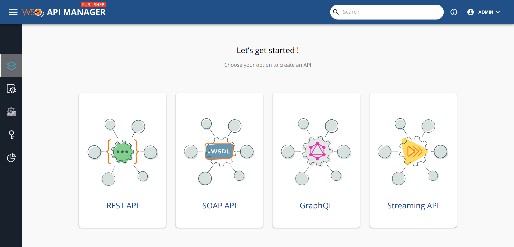
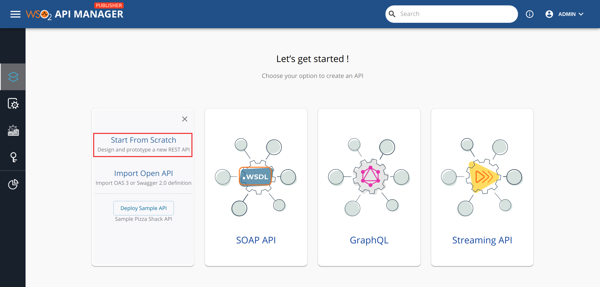
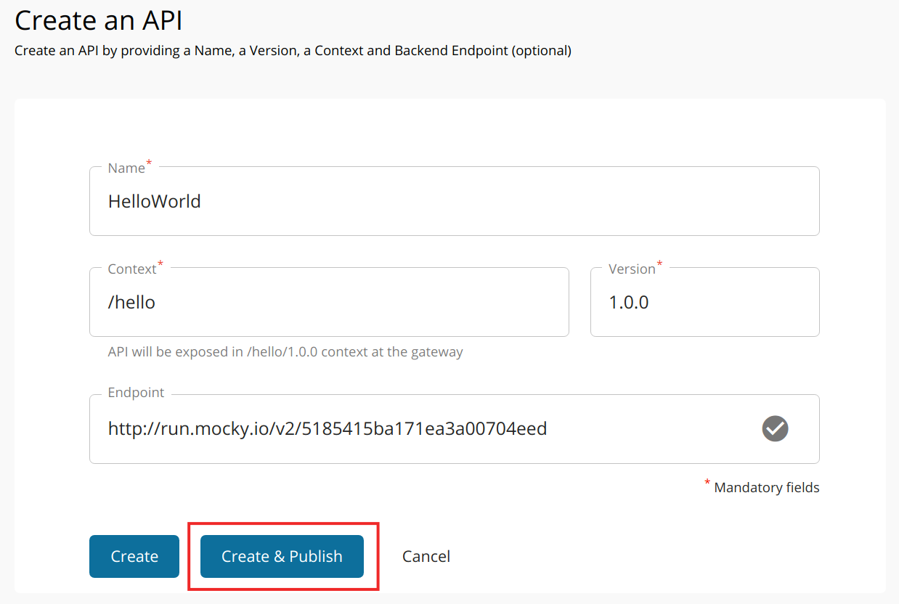
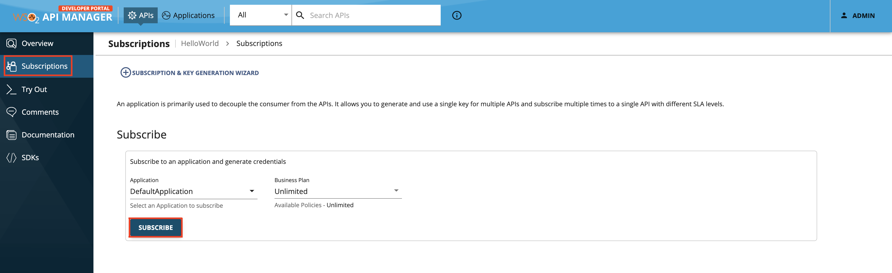
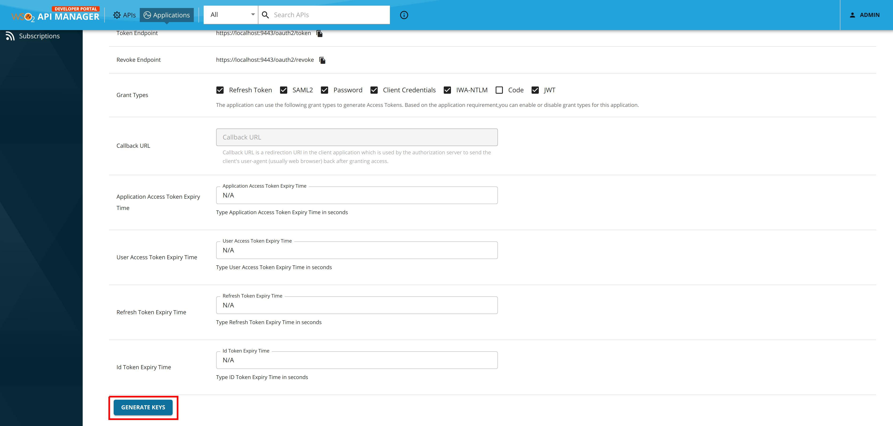
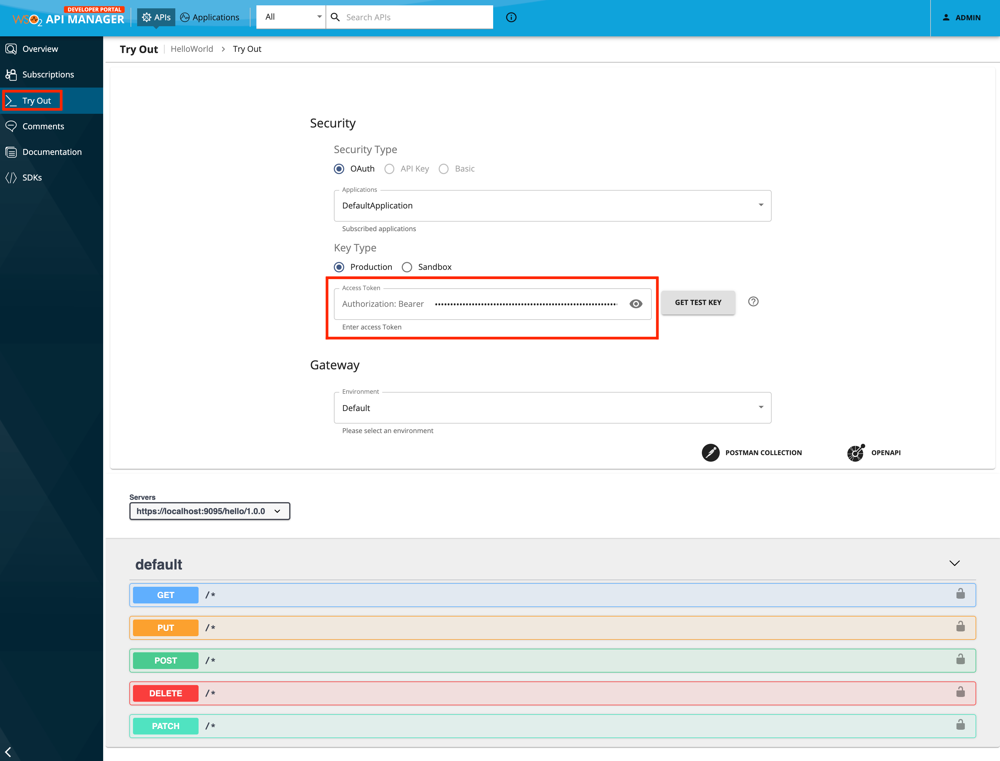
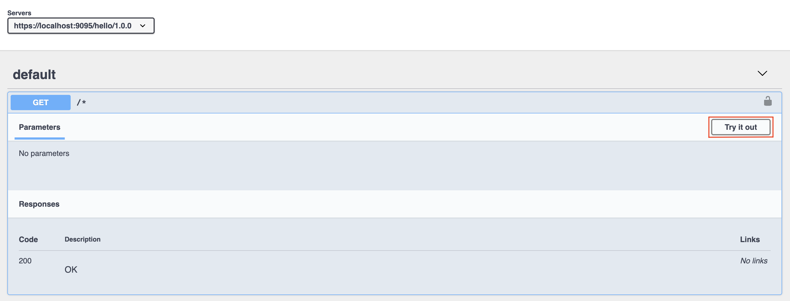
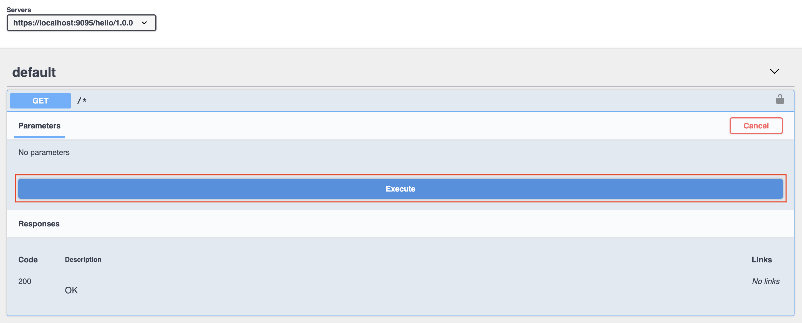
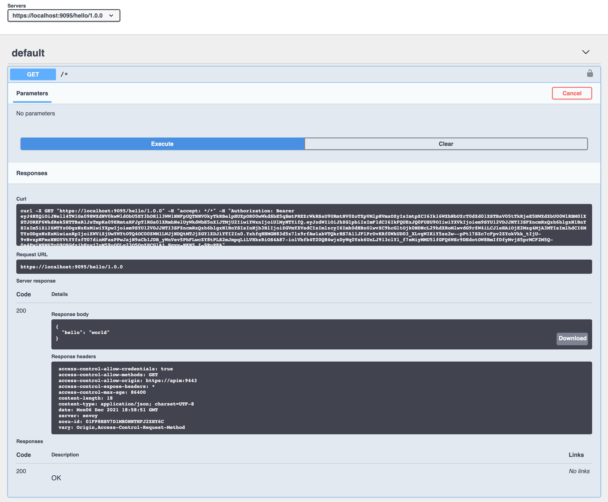

# Quick Start Guide

Let's start Choreo Connect with a WSO2 API Manager instance which will be acting as the Control Plane, deploy an API via Publisher, and invoke the API with an Access Token from Developer Portal.

!!! info "Before you begin"

    Make sure you have installed [Docker](https://docs.docker.com) and [Docker Compose](https://docs.docker.com/compose/) on your machine. Set up and allocate the following resources for Docker.

    - Minimum CPU : 4vCPU
    - Minimum Memory : 4GB

!!! important

    **Production Deployments - Choreo Connect**

    The Docker Compose based deployment option explained here is ***only for tryout purposes.*** This method is ***not recommended for production deployments***. For production deployments, you can use the following.

    - Kubernetes based Choreo Connect deployment with [Helm artifacts](../../../../deploy-and-publish/deploy-on-gateway/choreo-connect/getting-started/deploy/cc-on-kubernetes-with-apim-as-control-plane-helm-artifacts/) or [YAML artifacts](../../../../deploy-and-publish/deploy-on-gateway/choreo-connect/getting-started/deploy/cc-on-kubernetes-with-apim-as-control-plane/)
    - [Production Deployment Guideline](../../../../deploy-and-publish/deploy-on-gateway/choreo-connect/production-deployment-guideline/) for Choreo Connect 

    **Production Deployments - API Manager**

    The Docker Compose files referred in this guide are to deploy API Manager with ***basic configurations***. They are the docker-compose scripts ***provided with the Choreo Connect distribution*** and are only meant for tryout purposes. In order to deploy WSO2 API Manager in production grade, you can use the following. 
    
    - Docker setup artifacts from the [API Manager page](https://wso2.com/api-manager/)
    - [Production Deployment Guideline](../../../../install-and-setup/setup/deployment-best-practices/production-deployment-guidelines/#common-guidelines-and-checklist) for API Manager

### Step 1 - Download and extract the Choreo Connect distribution .zip file

1. Download the latest Choreo Connect distribution from [https://wso2.com/choreo/choreo-connect/](https://wso2.com/choreo/choreo-connect/). 
2. Extract the Choreo Connect distribution .zip file. The extracted folder will be called as `CHOREO-CONNECT_HOME` hereafter.

### Step 2 - Download WSO2 API Manager 4.2.0 .zip file

1. Download WSO2 API Manager 4.2.0 distribution .zip file from [https://wso2.com/api-manager/](https://wso2.com/api-manager/). 
2. Place the .zip file in `CHOREO-CONNECT_HOME`/docker-compose/choreo-connect-with-apim/dockerfiles/apim/.

### Step 3 - Start Choreo Connect and API Manager

1. Add the host entry to `/etc/hosts` file as shown below in order to access the API Manager Publisher and Developer Portal.

    ``` java
    127.0.0.1   apim
    ```

2. Start Choreo Connect and API Manager on docker by executing the docker compose script inside the `CHOREO-CONNECT_HOME/docker-compose/choreo-connect-with-apim` folder.

    ``` java
    docker-compose up -d
    ```

    Once the containers are up and running, you can monitor the status of the containers using the following command.

    ``` java
    docker ps | grep choreo-connect-
    ```

### Step 4 - Create and publish an API via API Manager

1. Navigate to the Publisher Portal.

    `https://apim:9444/publisher/`

2. Sign in with **`admin/admin`** as the credentials.

    [](../../../../assets/img/get_started/api-publisher-home.png)

3. Select **REST API** from the home screen and then click **Start From Scratch**.
   
    [](../../../../assets/img/get_started/design-new-rest-api.png)

4. Enter the following API details.

    | **Field**    | **Value**                        |
    |----------|-------------------------------------|
    | Name     | HelloWorld                     |
    | Context  | /hello                                 |
    | Version  | 1.0.6                               |
    | Endpoint | https://run.mocky.io/v2/5185415ba171ea3a00704eed |

    !!! note

        We are using a mock service from [https://designer.mocky.io/](https://designer.mocky.io/) as the endpoint to test the API. The above endpoint returns the json payload `{"hello": "world"}`.
     
     [{: style="width:60%"}](../../../../assets/img/get_started/api-create.png)

5. Click **Create & Publish**.

     This will publish your first API on the Developer Portal as well as deploy it on Choreo Connect. You now have an OAuth 2.0 secured REST API that is ready to be consumed.

    !!! tip   
        If you are further updating the API, remember create a new revision from the **Deployments** tab and deploy the newly created revision to the Gateway, for the changes to be reflected in Choreo Connect.

### Step 5 - Invoke the API from Publisher

1. Open **Try Out** from the left menu bar.

    <a href="../../../../../assets/img/design/create-api/test-api/publisher-testconsole-leftpane.png"></a>

2. In the Try Out page, you will find an Internal Key that has already been generated for you. You can click the button **Generate Key** whenever you need a new token.

    <a href="../../../../../assets/img/design/create-api/test-api/publisher-testconsole-generatekey.png"></a>

    !!! tip

        When invoking the API, this Internal Key authentication token will be included in the header `Internal-Key`. To learn more, click [Internal Key](../../../../deploy-and-publish/deploy-on-gateway/choreo-connect/security/api-authentication/internal-key-authentication/). 

3. Select one of the listed HTTP methods. Click **Try it out** and then click **Execute** to invoke the API.

    <a href="../../../../../assets/img/deploy/mgw/expanded-get-resource.png"></a>

    <a href="../../../../../assets/img/deploy/mgw/try-api.png"></a>

**That's it!** You have successfully invoked an API deployed in Choreo Connect.

You can follow the next few steps to get an idea about API Subscriptions, Application Rate limiting and Production Access Tokens. 

### Step 6 - Subscribe to the API and generate a token

1. Navigate to the Developer Portal and select the newly created API.

    `https://apim:9444/devportal/`

2. Navigate to the **Subscriptions** page. 

3. Subscribe the API to the default application visible as **DefaultApplication** with an available Rate Limiting Policy.

    [](../../../../assets/img/deploy/mgw/subscribe-to-api.png)

4. Navigate to the **Applications** tab. 

5. Click on **DefaultApplication**, navigate to **Production Keys** page and click **Generate keys** to generate a production key.

    [](../../../../assets/img/learn/generate-keys-production.png)

    !!! tip
        To generate keys for the Sandbox endpoint, go to the **Sandbox Keys** tab. For more information, see [Maintaining Separate Production and Sandbox Gateways](../../../../deploy-and-publish/deploy-on-gateway/api-gateway/maintaining-separate-production-and-sandbox-gateways/#multiple-gateways-to-handle-production-and-sandbox-requests-separately).

6. Copy the generated access token before proceeding to the next step.

### Step 7 - Invoke the API from Developer Portal

Follow the instructions below to invoke the previously created API with the generated token.

1. Go back to the **APIs** tab and select your API. Click **Try Out** on the left menu bar.

     The resources of the API will be listed.

2. Paste the access token that you previously copied in the **Access Token** field.

    [](../../../../assets/img/deploy/mgw/invoke-api.png)

3. **If this is the first time you are using the API test console** from your browser, open a new tab and navigate to the `https://localhost:9095/` URL.

     This will prompt your browser to accept the certificate used by Choreo Connect. This is required because, by default, Choreo Connect uses a self-signed certificate that is not trusted by web browsers.
    
    !!! important

        This self-signed certificate used by Choreo Connect must be replaced when deploying the system in production.

4. Click on the `GET` resource of the API to expand the resource and click **Try It Out**.
   
     [](../../../../assets/img/deploy/mgw/expanded-get-resource.png)

5. Click **Execute**.

     [](../../../../assets/img/deploy/mgw/try-api.png)

     You should see the `{"hello" : "world"}` response from the API. 

     [](../../../../assets/img/deploy/mgw/try-it-success.png)

__Congratulations!__ You have successfully created your first API, subscribed to it through an OAuth 2.0 application, obtained an access token for testing, and invoked your API with Choreo Connect.

## See also

- [Choreo Connect Overview](../../../../deploy-and-publish/deploy-on-gateway/choreo-connect/getting-started/choreo-connect-overview/)
- [Supported Features](../../../../deploy-and-publish/deploy-on-gateway/choreo-connect/getting-started/supported-features/)
- [Deployment Options](../../../../deploy-and-publish/deploy-on-gateway/choreo-connect/getting-started/deploy/cc-deploy-overview/)
- [Production Deployment Guide](../../../../deploy-and-publish/deploy-on-gateway/choreo-connect/production-deployment-guideline/)
