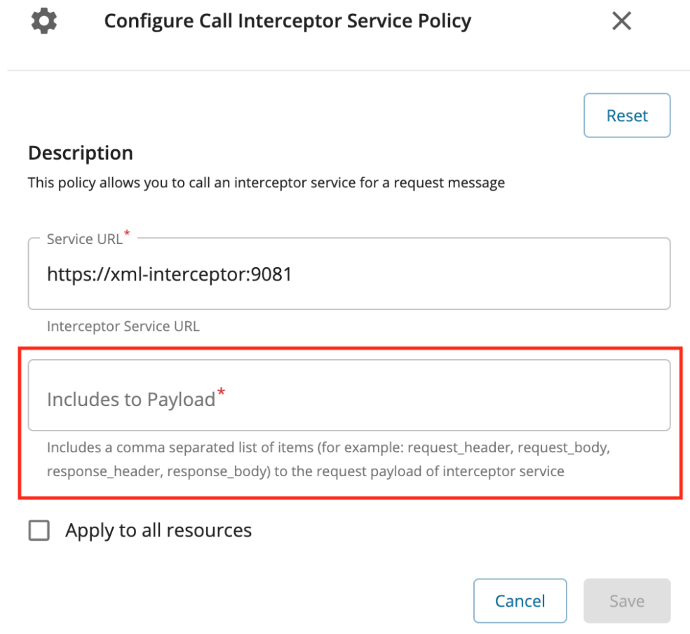

# Call Interceptor Service

You can use interceptors in Choreo Connect to carry out transformations and mediation on the requests and responses. Learn more about [Message Transformation](../../../deploy-and-publish/deploy-on-gateway/choreo-connect/message-transformation/message-transformation-overview/) in Choreo Connect.

[{: style="width:50%"}](../../../assets/img/design/api-policies/call-interceptor.png)

!!! note
    You can also define call interceptor configurations in the Open API specification. If both the Open API specification and the "Call Interceptor Service" API Policy is attached, the "Call Interceptor Service" API Policy overrides the call interceptor configurations defined in the Open API specification.

The policy attribute “Includes to Payload” in the Call Interceptor Service supports the following values in the request flow.

- request_headers
- request_body
- request_trailers
- invocation_context

For more information, see [Request flow interceptor](../../../deploy-and-publish/deploy-on-gateway/choreo-connect/message-transformation/defining-interceptors-in-an-open-api-definition/#request-flow-interceptor).

The following values are available in the response flow.

- request_headers
- request_body
- request_trailers
- response_headers
- response_body
- response_trailers
- invocation_context

For more information, see [Response flow interceptor](../../../deploy-and-publish/deploy-on-gateway/choreo-connect/message-transformation/defining-interceptors-in-an-open-api-definition/#response-flow-interceptor).
