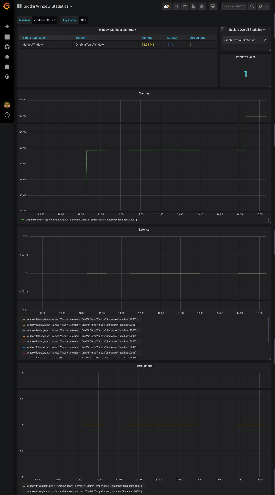
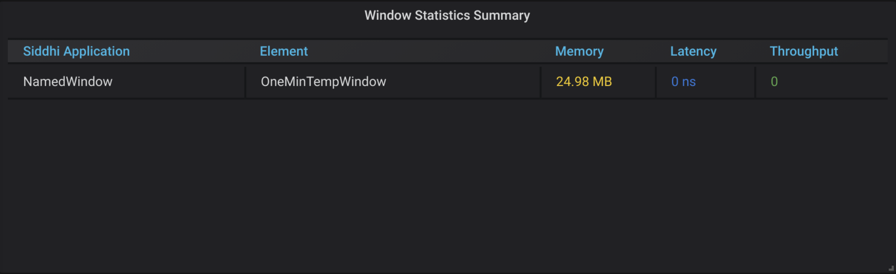
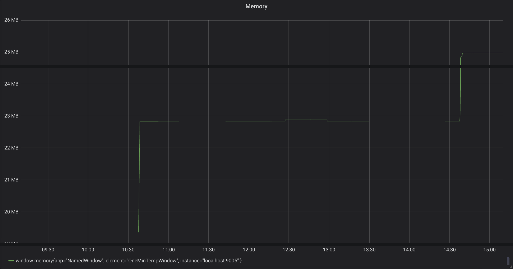
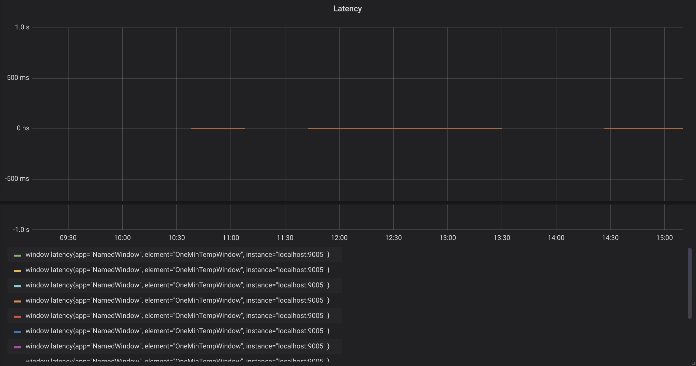
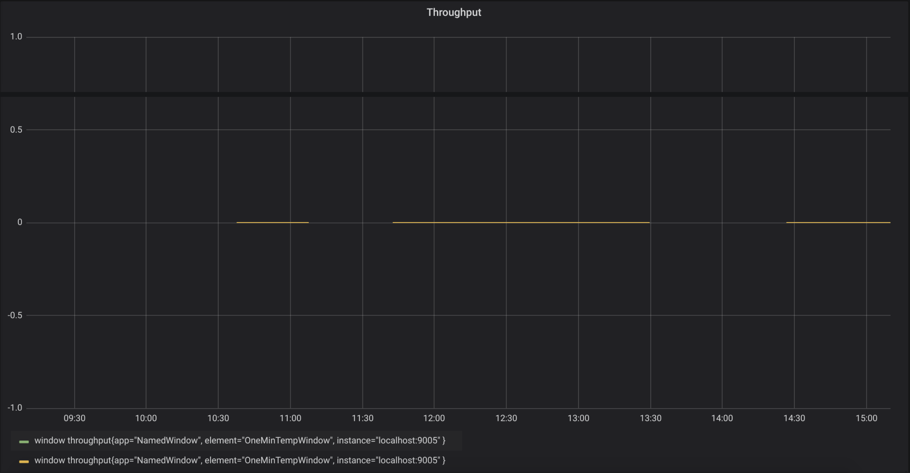

# Viewing Window Statistics

This dashboard displays the following information for your Streaming Integrator deployment:

## Window Statistics Summary Table

This lists all the windows from all the Siddhi applications in your Streaming Integrator server. The table displays the following for each window:

- The Siddhi application in which the window is included

- The name of the window

- The amount of memory used by the window

- Latency of events in the window

- The throughput of events to the window
   
## Memory

This shows the memory usage of each window in your Streaming Integrator server.

## Latency

This shows the latency of each window in your Streaming Integrator server.

## Throughput

This shows the throughput of each window in your Streaming Integrator server.