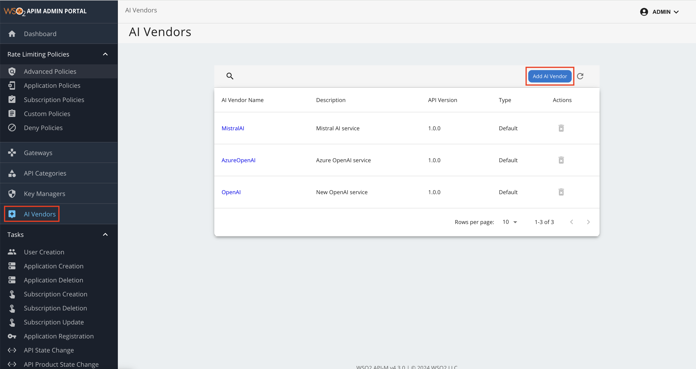
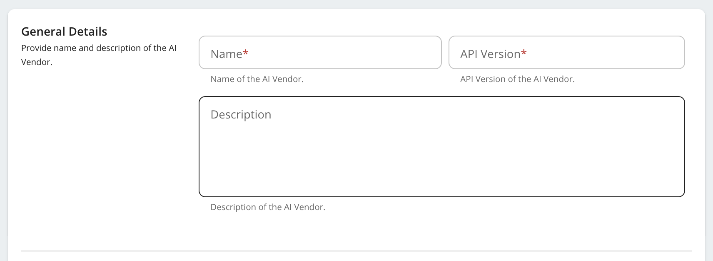
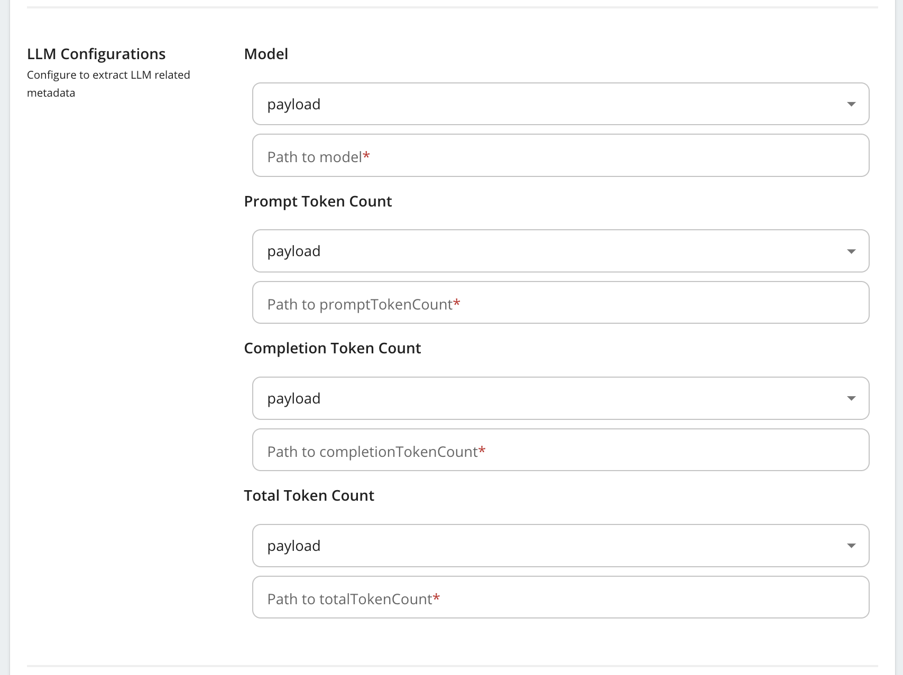
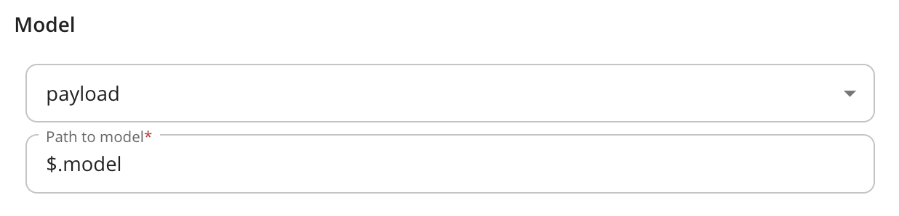
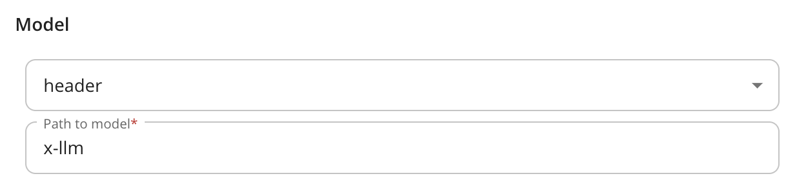
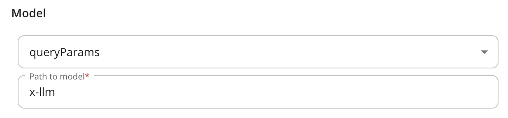
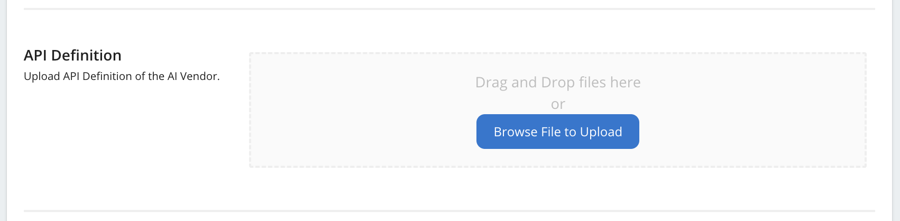
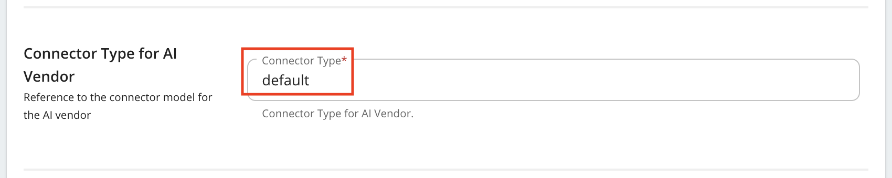

# Configure a Custom AI Vendor

You can integrate **WSO2 API Manager** with custom AI vendors to consume their services via AI APIs. This guide walks you through configuring a custom AI vendor to manage and track AI model interactions efficiently.

## Step 1 - Add a new AI Vendor

Navigate to the **AI Vendors** section in the WSO2 API Manager admin portal sidebar, and select **Add AI Vendor**.

[](../../assets/img/administer/custom-ai-vendor/add-ai-vendor.png)

## Step 2 - Provide the AI Vendor Name and Version.

[](../../assets/img/administer/custom-ai-vendor/custom-ai-vendor-general-details.png)

## Step 3 - Configure Data Extraction for AI Model and Token Usage.

This step involves configuring the extraction of key information from request/ response flow to support token-based throttling and analytics, including:

<table>
        <colgroup>
            <col />
            <col />
            <col />
        </colgroup>
        <tbody>
            <tr>
                <th colspan="2">Field</th>
                <th>Description</th>
            </tr>
            <tr>
                <td colspan="2">AI Model Name</td>
                <td>Name of the AI Model responding to the request</td>
            </tr>
            <tr>
                <td colspan="2">Prompt Token Count</td>
                <td>Number of tokens consumed by the request prompt</td>
            </tr>
            <tr>
                <td colspan="2">Completion Token Count</td>
                <td>Number of tokens consumed by the AI Model response</td>
            </tr>
            <tr>
                <td colspan="2">Total Token Count</td>
                <td>Number of tokens consumed by both request prompt and AI Model response</td>
            </tr>
        </tbody>
    </table>

[](../../assets/img/administer/custom-ai-vendor/custom-ai-vendor-general-details-llm-configurations.png)

1. If the data is in the request payload, specify the appropriate **JSON path** to extract the values.
[](../../assets/img/administer/custom-ai-vendor/ccustom-ai-vendor-general-details-llm-configurations-payload.png)

!!! example "Mistral AI Response Payload"
    Below outlines the structure of a sample Mistral AI response payload and provides details on how specific fields can be extracted using JSON paths.

    ```json
    {
    "id": "cmpl-e5cc70bb28c444948073e77776eb30ef",
    "object": "chat.completion",
    "model": "mistral-small-latest",
    "usage": {
        "prompt_tokens": 16,
        "completion_tokens": 34,
        "total_tokens": 50
    },
    "created": 1702256327,
    "choices": [
            {
            "index": 0,
            "message": {
                "content": "string",
                "tool_calls": [
                {
                    "id": "null",
                    "type": "function",
                    "function": {
                    "name": "string",
                    "arguments": {}
                    }
                }
                ],
                "prefix": false,
                "role": "assistant"
            },
            "finish_reason": "stop"
            }
        ]
    }
    ```

    - Extracting model information:
        - The `model` field is located at the root level of the response payload.
        - **Valid JSON Path**: `$.model`
    - Extracting prompt token count:
        - The `prompt_tokens` field is nested within the `usage` object.
        - **Valid JSON Path**: `$.usage.prompt_tokens`
    - Extracting completion token count:
        - The `completion_tokens` field is also nested within the `usage` object.
        - **Valid JSON Path**: `$.usage.completion_tokens`
    - Extracting total token count:
        The `total_tokens` field is located within the `usage` object.
        - **Valid JSON Path**: `$.usage.total_tokens`

2. If the data is in the request header, provide the header key.
[](../../assets/img/administer/custom-ai-vendor/custom-ai-vendor-general-details-llm-configurations-header.png)

3. If the data is in a query parameter, provide the query parameter identifier.
[](../../assets/img/administer/custom-ai-vendor/custom-ai-vendor-general-details-llm-configurations-queryparam.png)

## Step 4 - Upload the API Definition.

Upload the **OpenAPI specification** file provided by the custom AI vendor. This step defines the API endpoints and operations that the vendor offers.

[](../../assets/img/administer/custom-ai-vendor/custom-ai-vendor-openapi.png)

## Step 5 - Configure the Connector Type.

[](../../assets/img/administer/custom-ai-vendor/custom-ai-vendor-connectortype.png)

 <html><div class="admonition note">
 <p class="admonition-title">Note</p>
 <p>The <a href='https://github.com/wso2/carbon-apimgt/blob/master/components/apimgt/org.wso2.carbon.apimgt.api/src/main/java/org/wso2/carbon/apimgt/api/DefaultLLMProviderService.java'>`default`</a> connector type is a built in connector to extract AI model name, prompt token count, completion token count, total token count from the response.
 To write your own connector follow <a href='../../../administer/ai-vendors/write-ai-vendor-connector/'> 
 Write a connector for a Custom AI Vendor.</a></p>
 <p>
 </div>
 </html>
 