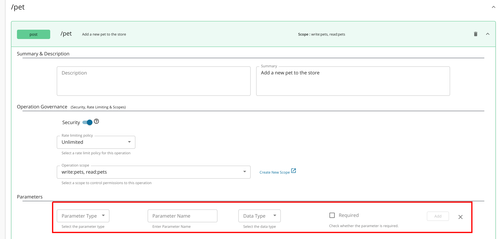
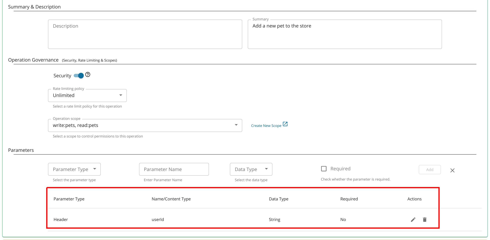
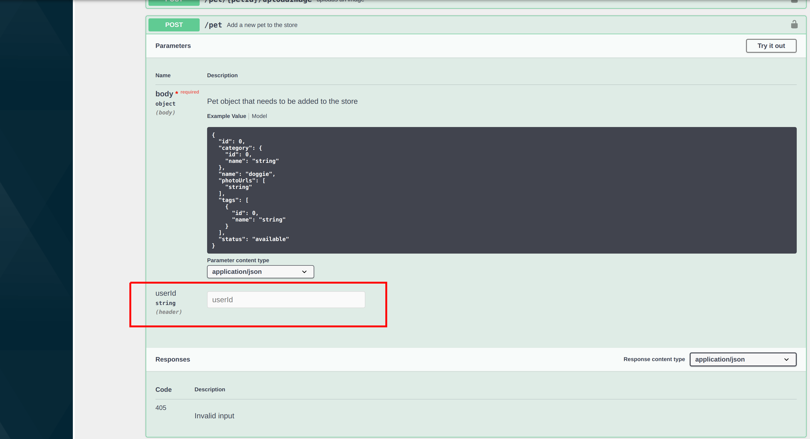

# Add Additional Headers to Test a REST API

Follow the instructions below to add additional headers when testing a REST API via the Integrated API Console:

!!! Note
    The Swagger API Console is a JavaScript client that runs in the Developer Portal and makes JavaScript calls from the Developer Portal to the API Gateway. In order to successfully invoke an API by specifying an additional header via the API console, first you must specify the header that you want to add, under the CORS ([Cross Origin Resource Sharing](https://developer.mozilla.org/en-US/docs/Web/HTTP/CORS)) configuration.

    Open the `<API-M_HOME>/repository/conf/deployment.toml` file, and specify the additional headers (`userId` in this case) under the `[apim.cors]` section. Alternatively, you could choose to add this additional header only to a specific API (for more information, see [Enabling Cors per API](../../../design/advanced-topics/enabling-cors-for-apis.md#enabling-cors-per-api)).

    **CORS configurations in deployment.toml**

    ``` java
        [apim.cors]
        enable = true
        allow_origins = "*"
        allow_methods = ["GET","PUT","POST","DELETE","PATCH","OPTIONS"]
        allow_headers = ["authorization","Access-Control-Allow-Origin","Content-Type","SOAPAction","userId"]
        allow_credentials = false
    ```


Next, let's see how to add the header as a parameter to the API Console.

1.  Log in to the API Publisher and click the API that you want to invoke (e.g., `PetStore` ).
2.  Click on the API and navigate to the resources tab. Choose the required resource (e.g `POST` method) to expand it. Note the parameters section highlighted below.

    

3.  Add a header parameter with the name `userId`. Once added the newly added parameter should be listed as follows.

    

4.  Once you are done, click **Save**.

5.  Log in to the Developer Portal, subscribe to the API and generate an access token for the application you subscribed with. Once done Click on the API and then navigate to the API console via the Test button.
    
6.  Once you expand the modified resource, you would notice that the added header parameter is visible in the API console and expecting an input.

    

   
You have now successfully added a header parameter to the API Console.
