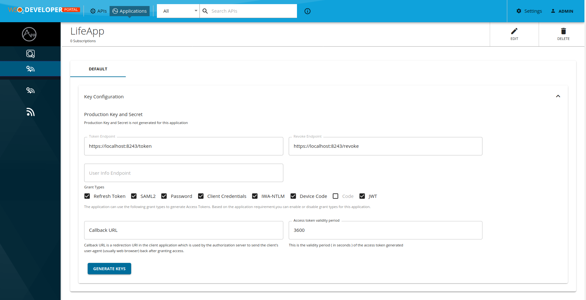
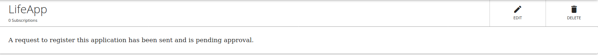
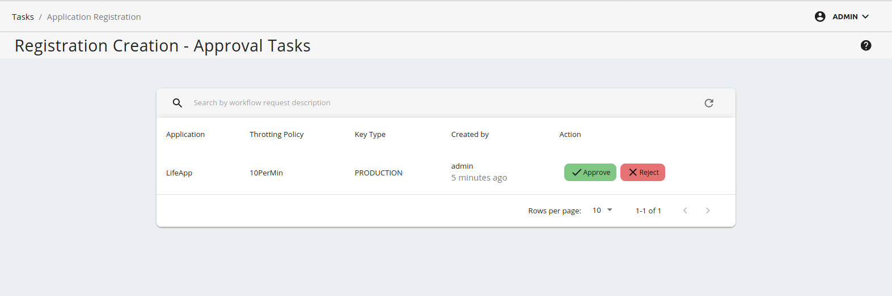
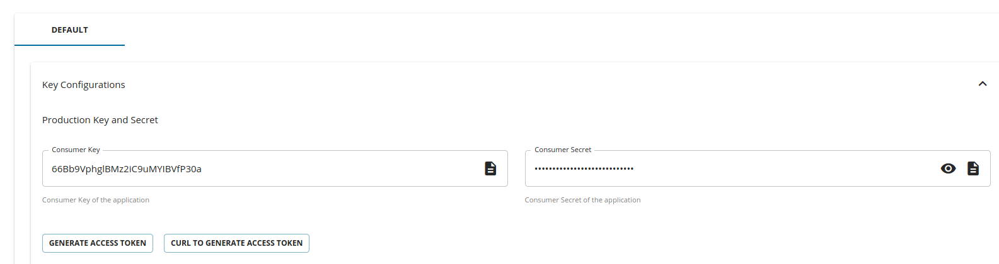
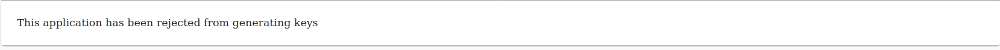

# Adding an Application Key Generation Workflow

This section explains as to how you can attach a simple approval workflow to the **application registration** operation in the API Manager. 

[Application creation](../../../consume/manage-application/advanced-topics/adding-an-application-creation-workflow.md) and **Application registration** are different workflows. After an application is created, you can subscribe to available APIs, but you get the consumer key/secret and access tokens only after registering the application. There are two types of registrations with regard to an application: production and sandbox. The following are the situations in which you need to change the default application registration workflow:

-  To only issue sandbox keys when creating production keys is deferred until testing is complete.
-  To restrict untrusted applications from creating production keys. You allow only the creation of sandbox keys.
-  To make API subscribers go through an approval process before creating any type of access token.

## Engage the Approval Workflow Executor in API Manager

First, enable the application registration workflow.

1.  Start WSO2 API Manager and sign in to the APIM management console (`https://<Server Host>:9443/carbon`).

2. Click **Main** --> **Registry** --> **Browse**.

     <a href="../../../../assets/img/learn/navigate-main-resources.png"></a>

3.  Go to the `/_system/governance/apimgt/applicationdata/workflow-extensions.xml` resource, disable the Simple Workflow Executor and enable **Approval Workflow Executor**  for application registration key generation. You can enable Approve workflow executor for Product keys or Sandbox keys or both by disabling the simple workflow executor and enable approval workflow executor for the ones you need. Please note that this workflow is not applicable for API keys generation.

    ``` xml
    <WorkFlowExtensions>
    ...
        <!--ProductionApplicationRegistration executor="org.wso2.carbon.apimgt.impl.workflow.ApplicationRegistrationSimpleWorkflowExecutor"/-->
        <ProductionApplicationRegistration executor="org.wso2.carbon.apimgt.impl.workflow.ApplicationRegistrationApprovalWorkflowExecutor"/>
    ...   
        <!--SandboxApplicationRegistration executor="org.wso2.carbon.apimgt.impl.workflow.ApplicationRegistrationSimpleWorkflowExecutor"/-->
        <SandboxApplicationRegistration executor="org.wso2.carbon.apimgt.impl.workflow.ApplicationRegistrationApprovalWorkflowExecutor"/>
    ...
    </WorkFlowExtensions>
    ```
    The application key generation Approve Workflow Executor is now engaged.

4.  Sign in to the API Developer Portal (<https://localhost:9443/devportal>) as a Developer Portal user and open the application with which you subscribed to the API. Click **Applications** and click on an **ACTIVE** application.


    !!! note
        If you do not have an API already created and an Application subscribed to it, follow [Create a REST API](../../../design/create-api/create-rest-api/create-a-rest-api.md), [Publish an API](../../../deploy-and-publish/publish-on-dev-portal/publish-an-api.md), and [Subscribe to an API](../../../consume/manage-subscription/subscribe-to-an-api.md) to create an API and subscribe to it.

5.  Select **Production Keys** or **Sandbox Keys** from the side navigation bar and click on **GENERATE KEYS**.
    
    

     Note that the following message will appear if the application key generation workflow is correctly enabled.

    

6.  Sign in to the Admin Portal (`https://<Server Host>:9443/admin`) with admin credentials and list all the tasks for application registrations from **Tasks** --> **Application Registration** and click on approve or reject to approve or reject the application key generation pending request. 

    

7.  Navigate back to the API Developer Portal and view your application.

     It shows the application access token, consumer key and consumer secret.
    
    

    If the workflow request is rejected  it will show a message.

    
    
