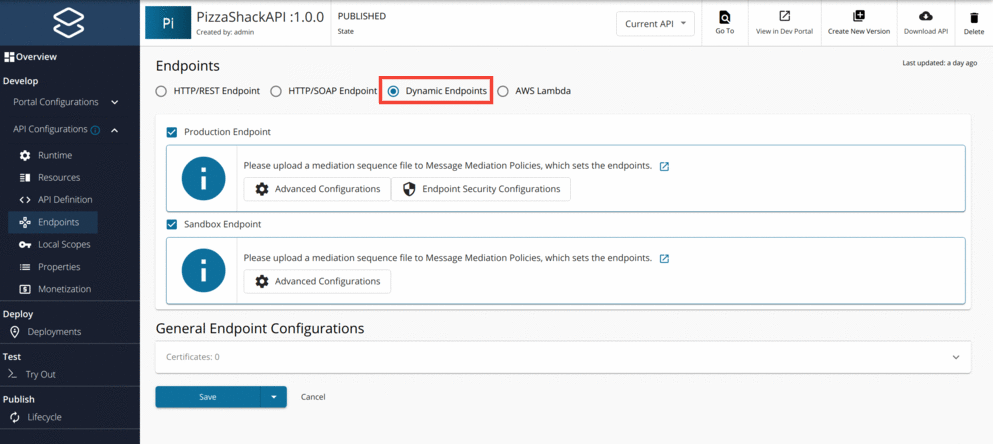

# Adding Dynamic Endpoints

You cannot dynamically construct the back-end endpoint of an API using the address endpoints in the WSO2 API Manager. To achieve the requirement of a dynamic endpoint, you can use the default endpoint instead. 

[](../../../assets/img/learn/api-gateway/message-mediation/dynamic-endpoints.png)  

The default endpoint sends the message to the address specified in the **To** header. The **To** header can be constructed dynamically. An example is given below.

!!! example
    ``` xml
    <sequence xmlns="http://ws.apache.org/ns/synapse" name="default-endpoint-seq">
        <property name="service_ep" expression="fn:concat('http://jsonplaceholder.typicode.com/', 'posts')"/>
        <header name="To" expression="get-property('service_ep')"/>
    </sequence>
    ```

In this example, you have constructed the `service_ep` property dynamically and assigned the value of this property to the **To** header. The default endpoint sends the message to the address specified in the **To** header, in this case, 
`http://jsonplaceholder.typicode.com/posts`. 

!!! info
    The dynamic endpoint functionality is suitable for scenarios where the application client can send an attribute in the request correlating to the intended endpoint (such as an HTTP transport header or as part of the payload), which can be used in the mediation extension.

!!! note
    The mediation extension is applied to all resources of the API. Therefore, all resources will contain a similar logic to construct the endpoint.

!!! tip
    For more details about working with dynamic endpoints, see [Endpoint Types](../../../learn/design-api/endpoints/endpoint-types.md).

You can copy the content of the above sequence to an XML file and upload it to an API configured with a dynamic endpoint using the Publisher Portal UI.

For more information, visit [Creating and Uploading Manually in API Publisher](../../../learn/api-gateway/message-mediation/changing-the-default-mediation-flow-of-api-requests.md#creating-and-uploading-manually-in-api-publisher).
