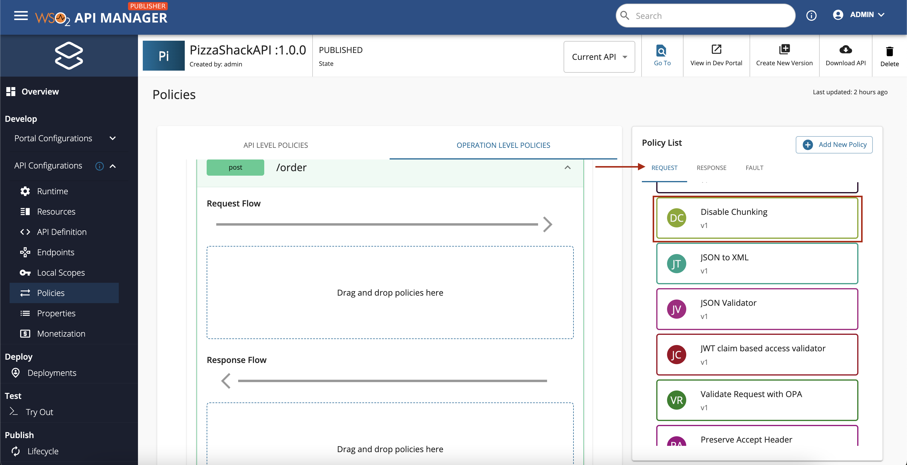
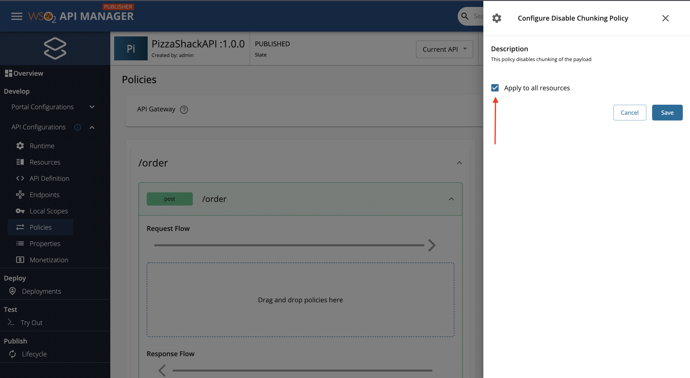
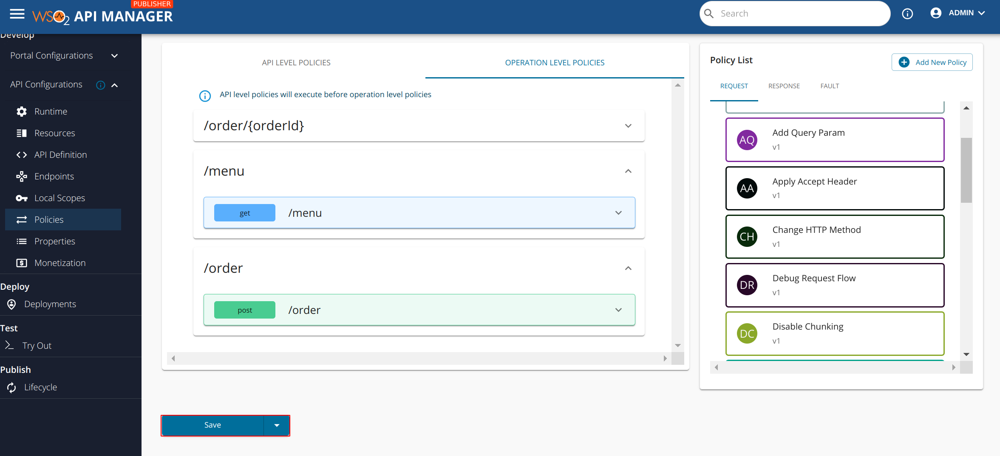

# Disabling Message Chunking

When processing large messages, message chunking facilitates sending the message as multiple independent chunks. 
Message chunking is set using the `Transfer-Encoding: chunked` header. However, some legacy backends might not support 
chunked messages. To disable sending chunked messages to the backend for a specific API, follow the steps below:

1.  Select any API and from the Left Menu, go to **API Configurations** --> **Policies**.
2.  Under the **Policy List** that appear on the right side of the screen, look for the **Disable Chunking** policy from the `Request` tab.

    

3.  Drag and drop the **Disable Chunking** policy from the policy list to the request flow of any desired API operation. In the below screenshot, the policy was dropped to the `/order POST` operation.

    In the policy configuring panel that appear from the right, select `Apply to all resources` option if you wish to attach the disable chunking policy to each and every resource of the current API. If you only wish to attach the policy to a particular API operation, leave the checkbox as it is. Then, click on **Save** button.

    

4.  Finally, scroll down and click on the **Save** button in order to apply the attached policies to the API.

    

Once the API is deployed and published, chunking is disabled for the message that is sent to the backend. 

!!! tip
    To stop chunked messages from being sent to the client, you can apply the same **Disable Chunking** policy to the `Response Flow` as well.
