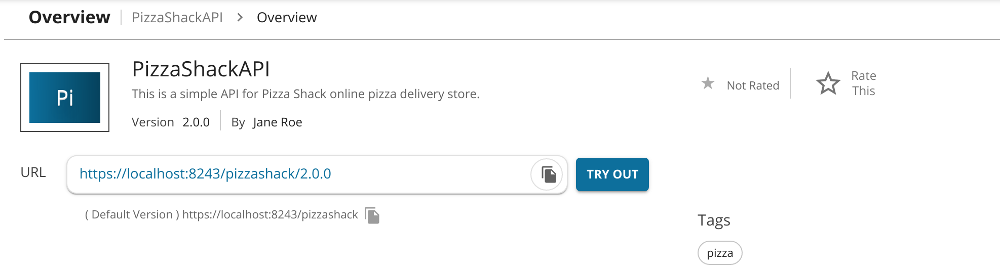

# Backward Compatibility

The following section explains the concept of a default version and backward compatibility with regard to an API version.

## Default version

The **Default Version** option means that you make this version the default in a group of different versions of the API. You can invoke a default API without specifying the version number in the URL. 

Example:

If you mark `http://<hostname>:<port>/pizzashack/2.0.0` as the default version when the API has 1.0.0 and 3.0.0 versions as well, requests made to `http://<hostname>:<port>/pizzashack/` get automatically routed to version 2.0.0.

If you mark any version of an API as the default, two API URLs are listed in its **Overview** tab in the Developer Portal. One URL appears with the version and the other URL appears without the version. You can invoke the default version of an API using either one of the latter mentioned URLs.
   
   

## Default version and Backward Compatibility

When you need to modify a published API, you can create a new version of the existing API. In addition, you can make the new version of the API the default API version, so that the subscribers who are using the default API URL for accessing the API can get the changes immediately. However, the changes made to the API version must be backward compatible in order to enable the subscribers to be able to use the API as they did before, without failures. 

!!! note
    For APIs, default version will be set to `false` when creating a new API. However for API Products, default version will be set to `true` when creating a new API Product.