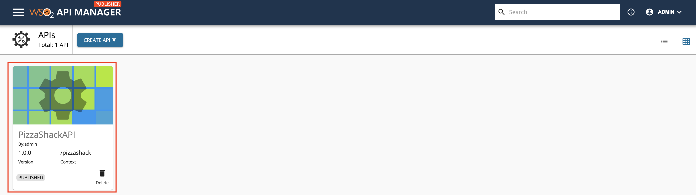
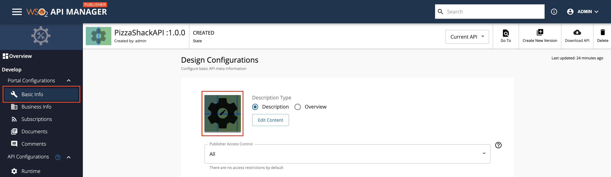
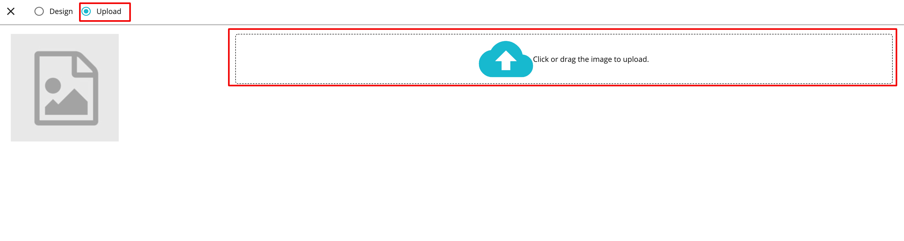
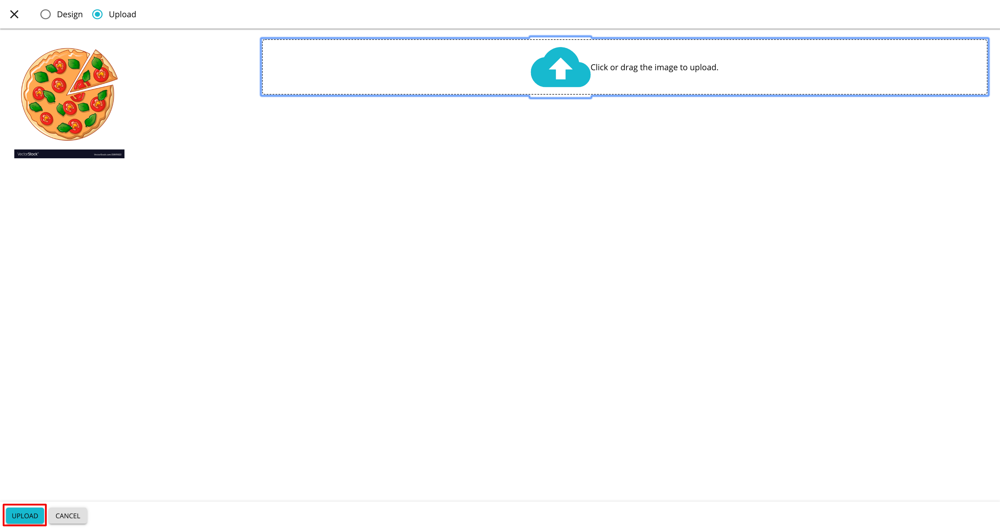

# Change the Thumbnail of an API

The thumbnail of an API can be changed by uploading an image for the thumbnail or by designing a new thumbnail image via the Publisher.

## Upload new API thumbnail

1. Sign in to API Publisher and click on the API that you want to change the thumbnail.
    
  
2. Click **Basic Info** and click the API Thumbnail image.
    
3. Click **Upload** and click on the Drop Zone to select an image for the thumbnail.
     
 
5. Click **Upload** to save the newly uploaded thumbnail.
      
  
    The newly added image appears as the API thumbnail.
    
    
