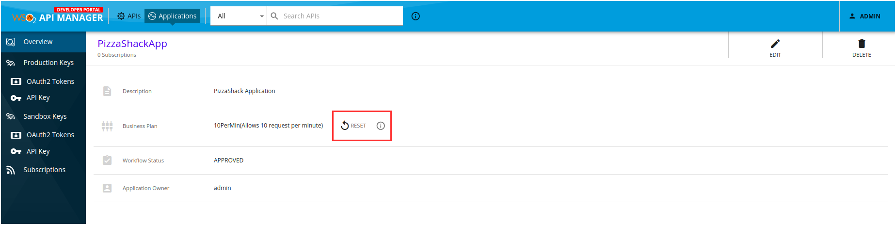
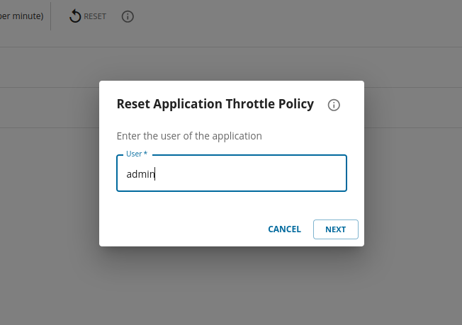
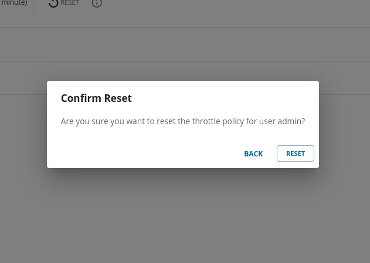

# Reset Application Throttling Policies

WSO2 API Manager allows you to reset the Application-level rate limiting tier for a specified end-user. This feature can be used by the application owner or shared owner to reset throttle policies by providing the username or the UUID of the application user on their request. 

For each application user, a counter is maintained at the traffic manager of API Manager. When the counter reaches the limit defined by the application throttle policy, the relevant application user will be throttled out and further API invocation will be restricted. If the user wants to continue invoking APIs using the application with same application throttle policy, the application owner can accommodate that by resetting the quota used by that specific user only.

1. Fill in the **User** (can be the username or the UUID of the end-user) whose quota needs to be reset and click **Next**.

    [{: style="width:55%"}](../../assets/img/learn/application-reset-dialog.png)

    !!! note
        The username or UUID you provided will not be validated at the API Manager level. You will not get feedback on whether the intended user's quota is reset. Hence, Make sure the username or UUID is correct and valid before proceeding.  

2. Confirm whether the **User** is correct and click **Reset**.  

    [{: style="width:55%"}](../../assets/img/learn/application-reset-dialog-confirm.png)

Upon clicking the **Reset** button, a reset request will be sent to the traffic manager with the user and a notification saying 'Reset request has been triggered successfully' will pop up. This does not guarantee that the reset is complete. In case of invalid or incorrect usernames or UUIDs, the notification may still pop up. User may have to invoke the APIs using the application to verify reset is successful.

!!! info
    **How to find the username or the UUID ?**

    The username or the UUID used by the traffic manager to recognize the user will not be straightforward to find in some cases. 

    -   If the user uses Oauth grant type [**Client-Credentials Grant**](../../design/api-security/oauth2/grant-types/client-credentials-grant.md) to obtain the access token, it will be the normal username of the application owner.(Since you are accessing apis on behalf of the client and individual user is not direclty involved).
    -   For [**Password Grant**](../../design/api-security/oauth2/grant-types/password-grant.md) and [**Authorization Code Grant**](../../design/api-security/oauth2/grant-types/authorization-code-grant.md), **User** will be the **UUID** of the user. 
    
    Further, a log-based analytic solution such as [**ELK Analytics**](../../api-analytics/on-prem/elk-installation-guide.md) and [**Datadog Analytics**](../../api-analytics/on-prem/datadog-installation-guide.md) can be used to identify the **User**. For each successful API invocation, a log will be triggered with the details related to the API and the application. There is a field in the log which shows the user who invoked the API. An example is `"userName":"c10bcb9b-eabb-40d6-93be-c7f2a41682b1@carbon.super"`. Here you can exclude the **tenant domain** part (`@carbon.super`) and input the remaining **UUID** (`c10bcb9b-eabb-40d6-93be-c7f2a41682b1`) as the **user** in reset throttle policy dialog box.
