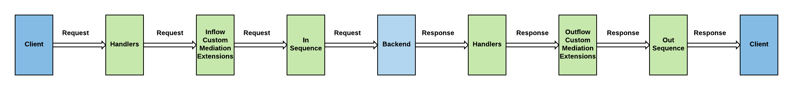

# Message Flow in the API Manager Gateway

The Gateway of an API Manager deployment is responsible for the main business functionality of serving API traffic. The following diagram illustrates the message flow in the Gateway at a very high level.

- [Message Flow in the API Manager Gateway](#message-flow-in-the-api-manager-gateway)
    - [The handlers](#the-handlers)
    - [Mediation extensions](#mediation-extensions)
    - [In sequence and out sequence](#in-sequence-and-out-sequence)

### The handlers

The handlers are request and response interceptors. The list of API handlers in WSO2 API-M are as follows:

-   CORSRequestHandler
-   APIAuthenticationHandler
-   ThrottleHandler
-   APIMgtGoogleAnalyticsTrackingHandler
-   APIManagerExtensionHandler

Each handler performs a specific task as mentioned in the table below. Note that some handlers are functional both at the inflow and outflow of messages.

| Handler                              | Inflow                                                              | Outflow                                                         |
|--------------------------------------|---------------------------------------------------------------------|-----------------------------------------------------------------|
| CORSRequestHandler                   | Set CORS Headers                                                    | Set CORS Headers                                                |
| APIAuthenticationHandler             | Request authentication                                              | N/A                                                             |
| ThrottleHandler                      | Request throttling                                                  | N/A                                                             |
| APIMgtGoogleAnalyticsTrackingHandler | Publish data to Google Analytics, if Google Analytics is configured | N/A                                                             |
| APIManagerExtensionHandler           | Execute custom mediation sequences at inflow                        | Execute custom mediation sequences at outflow                   |

### Mediation extensions

Mediation extensions enable you to define custom logic that can be executed during the inflow or outflow of API requests.  To learn more about mediation extensions, see [API Policy](../../design/api-policies/overview.md) .

### In sequence and out sequence

The in sequence and out sequence carry the main business logic of the request flow. The in sequence handles sending the request from the client to the backend, while the out sequence routes the response sent from the backed to the client.
