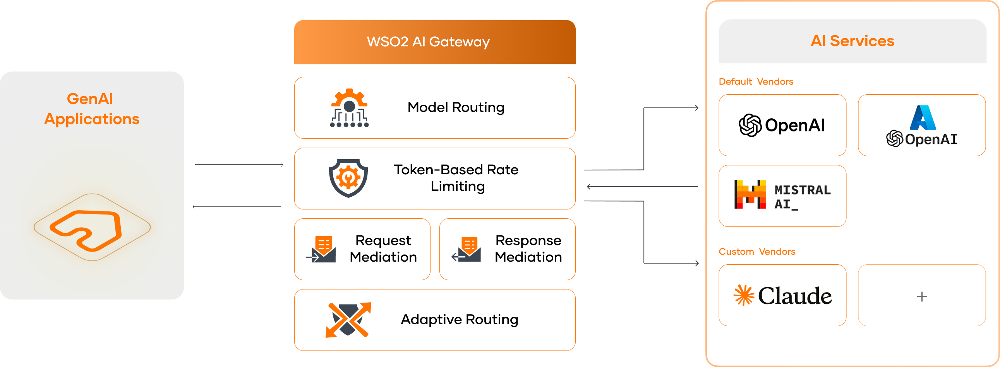

# AI Gateway

As AI adoption accelerates, managing AI APIs effectively has become essential for organizations integrating AI into their applications. WSO2 API Manager's **AI Gateway** simplifies this process, providing a seamless way to create, manage, and expose AI APIs with robust security and scalability.

[{: style="width:90%"}](../assets/img/learn/ai-gateway/ai-gateway.png)

WSO2 API Manager offers built-in support for **OpenAI**, **Azure OpenAI**, and **Mistral**, while also allowing the configuration of custom AI vendors, enabling flexible AI API creation.

With a comprehensive set of capabilities, the AI Gateway ensures secure and efficient AI integration. Key features include:

- **AI API Creation**: Create AI APIs by selecting an AI vendor and version.

- **AI Vendor Key Configuration**: Securely authenticate AI APIs by configuring API keys obtained from the AI vendor.

- **Rate Limiting**: Protect AI backends by enforcing token-based rate limits to manage resource consumption.

- **Multi-Model Routing**: Dynamically route AI API requests across multiple models within a vendor for optimized performance.

- **AI Vendor Management**: Manage both default and custom AI vendors to streamline AI API administration.

- **AI API Observability**: Track AI API usage statistics using [Analytics](../monitoring/api-analytics/choreo-analytics/api-analytics-architecture.md) solutions.

By leveraging these capabilities, organizations can efficiently integrate, monitor, and scale AI APIs, unlocking the full potential of AI-driven applications.
