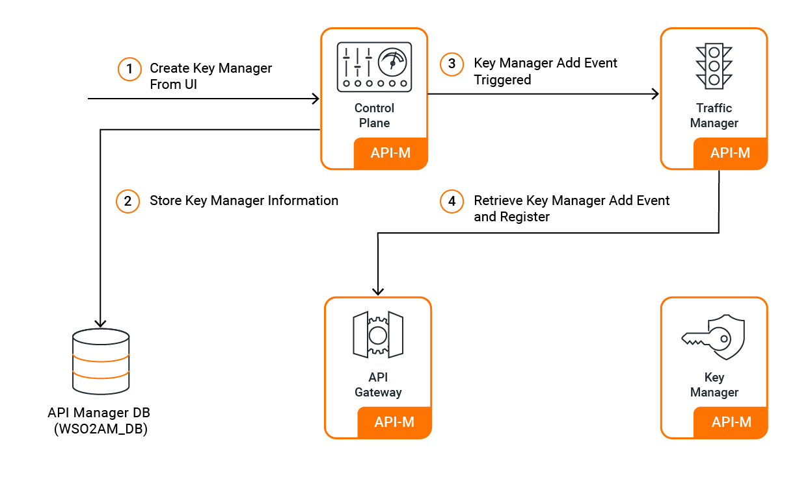

# Third-Party Key Manager Integration

WSO2 API Manager supports integration with external authorization servers as Key Managers, enabling organizations to leverage existing enterprise identity providers alongside the built-in Key Manager.

## Multiple Key Manager Support

Organizations can configure multiple Key Managers within a single tenant, allowing different APIs and applications to use different authorization servers based on business requirements. Administrators configure these through the Admin Portal, making them available for developers and API creators.

[{: style="width:80%"}](../../../assets/img/administer/add-km-overview.png)

## Supported Third-Party Key Managers

### Enterprise Identity Providers
- **[WSO2 Identity Server](../../../api-security/key-management/third-party-key-managers/../../../administer/key-managers/configure-wso2is-connector.md)**: Full-featured identity and access management platform
- **[WSO2 Identity Server 7.x](../../../api-security/key-management/third-party-key-managers/../../../administer/key-managers/configure-wso2is7-connector.md)**: Latest identity server with enhanced capabilities  
- **[Keycloak](../../../api-security/key-management/third-party-key-managers/../../../administer/key-managers/configure-keycloak-connector.md)**: Open-source identity and access management solution

### Cloud Identity Services
- **[Okta](../../../api-security/key-management/third-party-key-managers/../../../administer/key-managers/configure-okta-connector.md)**: Cloud-based identity service integration
- **[Auth0](../../../api-security/key-management/third-party-key-managers/../../../administer/key-managers/configure-auth0-connector.md)**: Developer-focused identity platform
- **[Azure AD](../../../api-security/key-management/third-party-key-managers/../../../administer/key-managers/configure-azure-ad-key-manager.md)**: Microsoft Azure Active Directory integration

### Enterprise Platforms
- **[PingFederate](../../../api-security/key-management/third-party-key-managers/../../../administer/key-managers/configure-pingfederate-connector.md)**: Enterprise federation and single sign-on
- **[ForgeRock](../../../api-security/key-management/third-party-key-managers/../../../administer/key-managers/configure-forgerock-connector.md)**: ForgeRock Identity Platform integration

### Custom Integration
- **[Custom Key Manager](../../../api-security/key-management/third-party-key-managers/../../../administer/key-managers/configure-custom-connector.md)**: Build connectors for proprietary authorization servers
- **[Custom Key Manager (Out-of-Band Provisioning)](../../../api-security/key-management/third-party-key-managers/../../../administer/key-managers/configure-custom-km-out-of-band.md)**: Integrate any external authorization server using Out-of-Band provisioning mode
- **[Global Key Manager](../../../api-security/key-management/third-party-key-managers/../../../administer/key-managers/configure-global-key-manager.md)**: Cross-tenant key manager configuration
