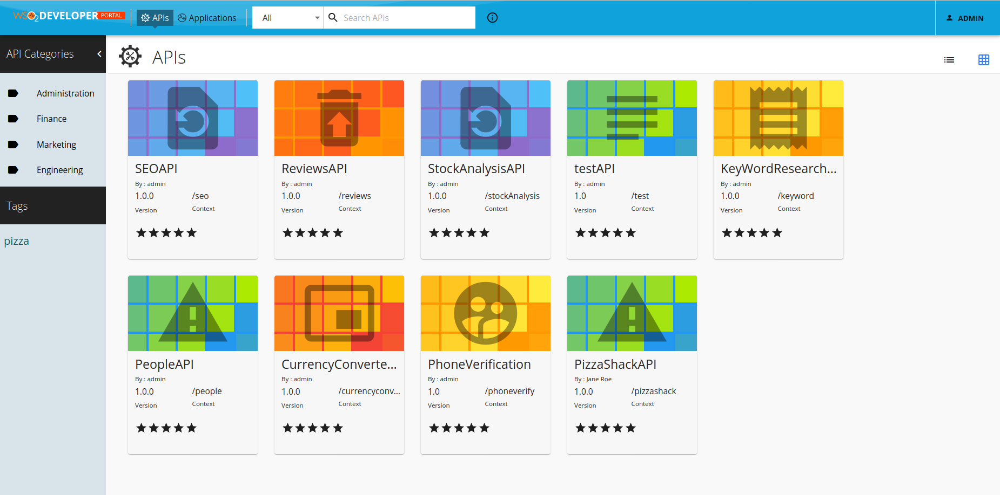
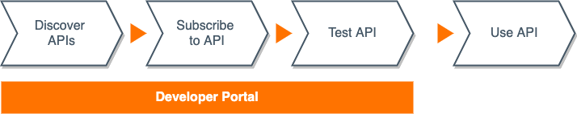

# Consumer API - Overview

An API Consumer is typically an application developer who may be internal or external to your organization. Consuming APIs is the process by which the application developer accesses the various APIs that are exposed by you (the API provider) and then uses those APIs to develop one’s own software applications and products. 

API consumers discover and access APIs from the **Developer Portal** of your WSO2 API Manager as shown below.

## API Consumer Tasks

The process of consuming an API from WSO2 API Manager involves the following steps:

### Discover APIs

When APIs are created and published through the **Publisher**, they become available through the **Developer Portal**. Developers can use the search option to find APIs of interest.

-   <a href="../consume/discover-apis/search.md">Searching for APIs</a>

### Subscribe to APIs

Before using an API, the developer must first subscribe to the APIs and obtain the required authentication keys through an **application**.

**Applications**

An application is a logical representation of a physical application such as a mobile app, webapp, device, etc. An API subscription is created, authenticated, and managed through an application. Find out more about [applications](../consume/manage-application/create-application.md).

**Authentication**

The subscription process is authenticated using OAuth2 by default. The authentication keys are generated for each application per gateway environment (Production or Sandbox). When the subscribing developer invokes the API through an application, the access token for the relevant gateway environment should be used.

**Business Plans**

Developers need to select a business plan for each API subscription. The business plan determines the number of requests that are allowed to be sent to the API per minute. Therefore, this is also the [throttling policy](../manage-apis/design/rate-limiting/introducing-throttling-use-cases.md) that applies to a subscription.

### Test APIs

Before using an API for development, the API consumer may want to test it’s capabilities. The following options are available in the Developer Portal for testing:

-   <a href="../consume/invoke-apis/invoke-apis-using-tools/invoke-an-api-using-the-integrated-api-console.md">Test APIs using the Integrated API Console</a>
    -   <a href="../consume/invoke-apis/invoke-apis-using-tools/include-additional-headers-in-the-api-console.md">Include Additional Headers in the API Console</a>
-   <a href="../consume/invoke-apis/invoke-apis-using-tools/invoke-an-graphql-api-using-the-integrated-graphql-console.md">Test GraphQL APIs Using the Integrated GraphQL Console</a>
-   <a href="../consume/invoke-apis/invoke-apis-using-tools/invoke-an-api-using-a-soap-client.md">Test an API Using a SOAP Client</a>
 -   <a href="../consume/invoke-apis/invoke-apis-using-tools/try-out-using-postman.md">Test a REST API Using Postman</a>

## Rate and Support APIs

As members of the API consumer community, developers can rate and support the APIs through the Developer Portal. This is also a forum where API consumers can give feedback to the API providers.
