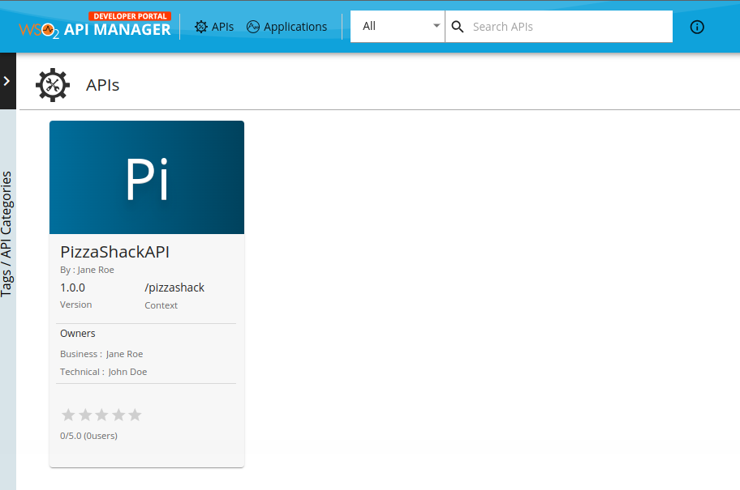
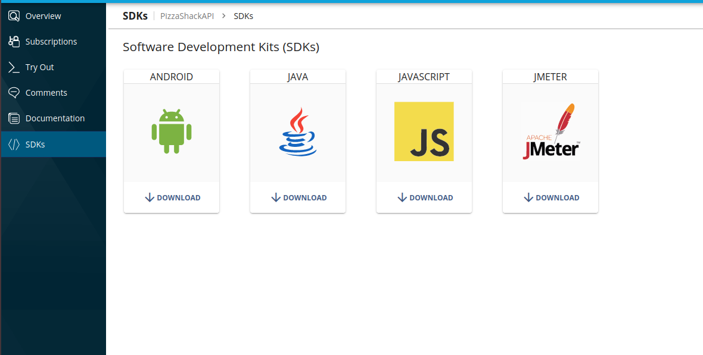
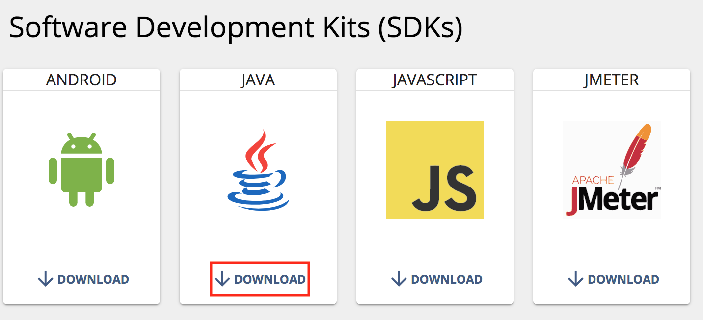

# Generate SDKs in the Developer Portal

A Software Development Kit (SDK) is a set of software development tools that allows you to create applications for a specific platform. If an API consumer wants to create an application, they can generate a client-side SDK for a supported language/framework and use it to write a software application to consume the subscribed APIs. 

## Downloading SDKs from the Developer Portal

Follow the instructions below to generate and download client-side SDKs via the Developer Portal:

1.  Sign in to the WSO2 API Developer Portal.

      (`https://<hostname>:<port>/devportal`)

2. Click on the API for which you want to generate a client-side SDK (e.g., `PizzaShackAPI`).

      [{: style="width:80%"}](../../assets/img/consume/select-api-dev-portal-with-business-info.png)
 
3.  Click **SDKs**. 

      The default SDKs that you can download appear. 

      [](../../assets/img/consume/default-sdks.png)
    
4.  Click **Download** to download the required SDK. 

      This downloads the ZIP archive of the SDK.

      <a href="../../assets/img/learn/download-sdk.png"></a>    
    
##  Configuring supported languages for SDK generation

By default, **Android, Java, JavaScript**, and **JMeter** the SDKs that are available to be downloaded via the Developer Portal in WSO2 API Manager (WSO2 API-M). In addition to the latter mentioned SDKs, WSO2 API Manager also supports SDK generation for the following languages. **C-Sharp (C#), Dart, Groovy, Perl, PHP, Python, Ruby, Clojure, Swift 5**.

Follow the instructions below to configure the languages available for SDK generation:

1.  Open `<API-M_HOME>/repository/conf/deployment.toml` file.

2.  Add the following configuration to specify the required languages.

    ```toml
    [apim.sdk]
    supported_languages = ["android", "java", "csharp", "dart", "groovy", "javascript", "jmeter", "perl", "php", "python", "ruby", "swift5", "clojure"]

    ```
    
3.  [Restart the server](../../install-and-setup/install/installing-the-product/running-the-api-m.md) to apply the configuration changes.
