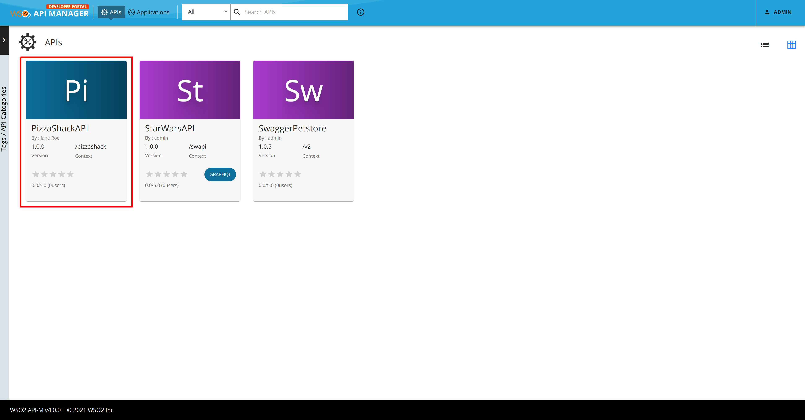
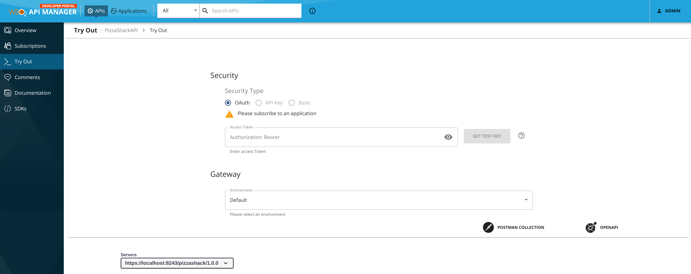
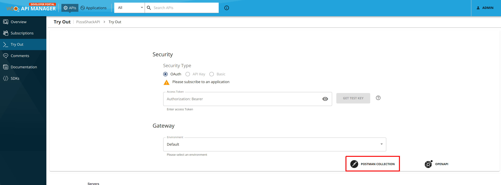
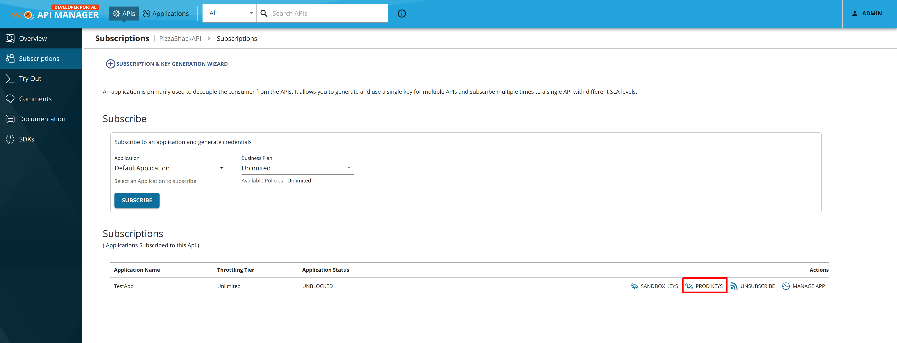
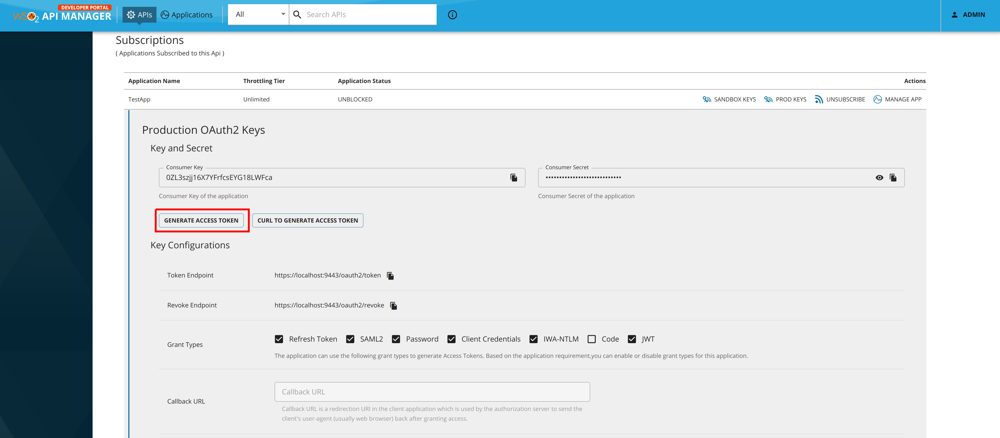
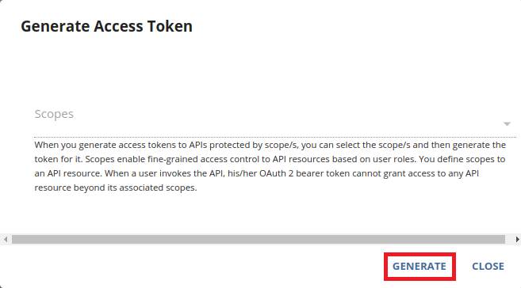
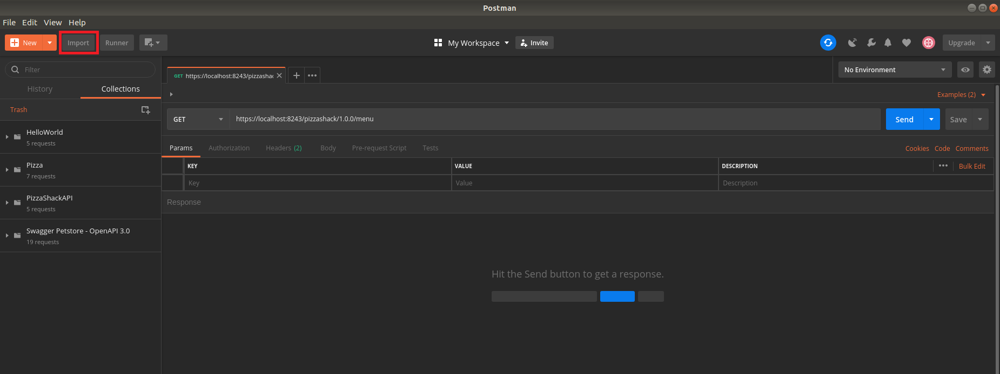
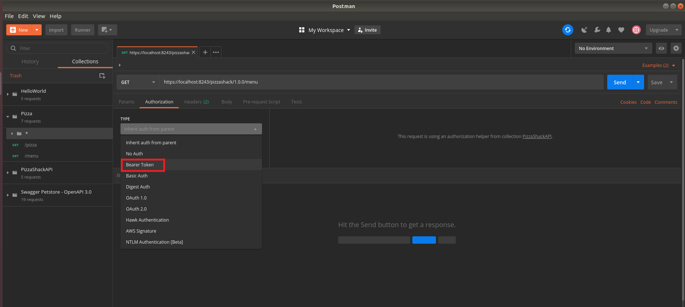
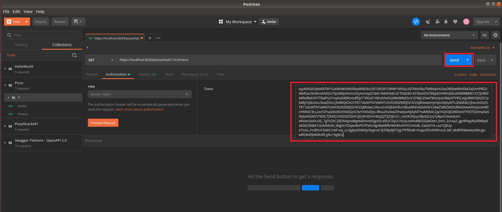
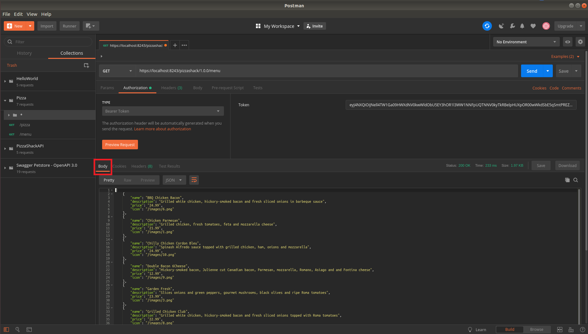

# Test a REST API Using Postman

You can download a Postman collection for an **OpenAPI** using WSO2 API Manager, and test the REST API using Postman.

!!! note "Try out using the Integrated API Console"
    If required, instead of using Postman you can try out your REST APIs using the [Integrated API Console](../../../consume/invoke-apis/invoke-apis-using-tools/invoke-an-api-using-the-integrated-api-console.md) in WSO2 API Manager.
    
Let's download an OpenAPI as a Postman collection and try it out using Postman.

## Step 1 - Download a Postman collection for the API

Follow the instructions below to download an OpenAPI as a Postman collection:

1.  Sign in to the WSO2 Developer Portal.

     `https://<hostname>:9443/devportal`

2. Click an API (e.g., `PizzaShackAPI`) to go to the API overview.

    

2.  Click **Try Out** to go to the Try out section.

    

3.  [Subscribe to an API](../../../consume/manage-subscription/subscribe-to-an-api.md) if you have not done so already.

4. Select the application name and click **Postman collection**.
     
     This downloads the Postman collection.

    
    
## Step 2 - Try out the collection in Postman

Follow the instructions below to try out the Postman collection that contains the Open API.

1. Get the authentication code.
     
     This is required because the Postman collection is secured.

     1. Click **Subscriptions**.

     2. Click the **PROD KEYS** to generate an Access Token.

         

     3. Click **Generate Access Token** to generate a new token. 

         
    
     4. Click **Generate**.

         
    
     5. **Copy** the access token you generated.

2. Open the Postman application and click **Import** to import the Postman collection file that you downloaded.

     

3. Select a resource from the Postman collection to test.

4. Click on the **Authorization** tab and select **Bearer Token** as the token type.

     

5. Paste the copied token.

6. Click **Send** to proceed.

     

     You can now see the result under the **Body** tab.

     
