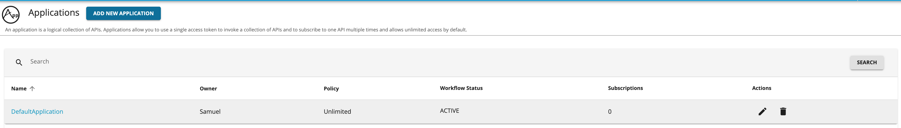
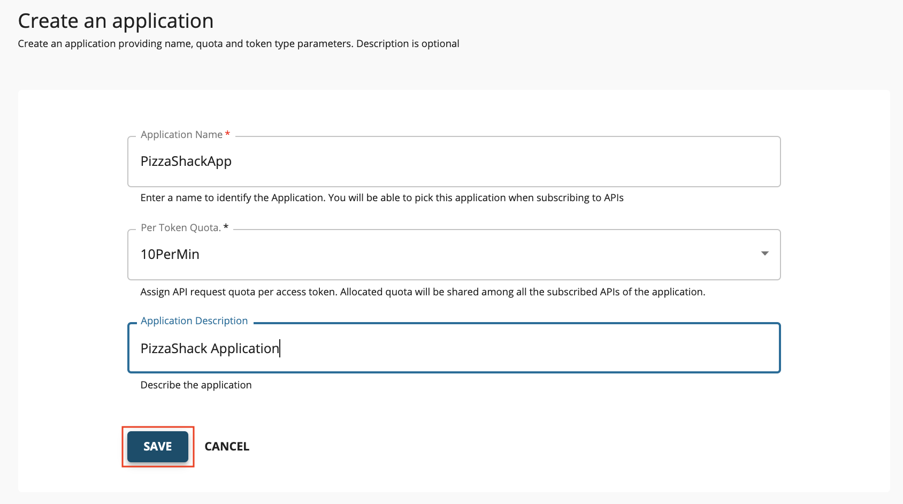
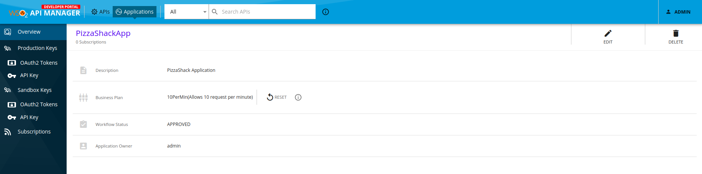
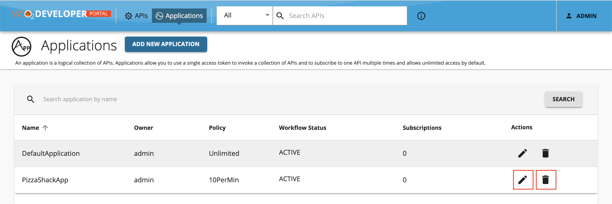

# Create Applications

An application is a logical representation of a physical application such as a mobile app, webapp, device, etc. If an application needs to consume an API, it should subscribe to the required API over a selected business plan, which determined the usage quota the application is allowed. A single application can have multiple API subscriptions. Each application has a consumer key and consumer secret pair. The requests to the subscribed APIs are authenticated via the tokens generated using the latter mentioned security credentials.

Applications allow you to:

-   Generate and use a single key for multiple APIs.
-   Subscribe multiple times to a single API with different Service Level Agreements (SLAs)/business plans which 
operate on per access token basis.

WSO2 API Manager comes with a pre-created default application, which allows unlimited access by default. You can also [create](../../consume/manage-application/create-application.md#create-a-new-application) your own.

## Create a new application

1.  Sign in to WSO2 API Manager Developer Portal (`https://<hostname>:9443/devportal`).

2.  Click **Applications**.

3.  Click **ADD NEW APPLICATION**.

    

4.  Enter the application details and click **SAVE** to create the application.
   
       Let's create an application with the following details.
   
     <html>
        <table>
        <th>Field</th><th>Value</th>
        <tr><td>Application Name</td><td>PizzaShackApp</td></tr>
        <tr><td>Per Token Quota</td><td>10PerMin</td></tr>
        <tr><td>Description</td><td>PizzaShack Application</td></tr>
        </table>
     </html>

    !!! note
        From API-M 3.1.0 onwards the options to select key types and multiple key managers have been removed.

       
      
       If the application creation is successful, you will be redirected to the application overview page.

       
    
5.  Click **Applications** to navigate to Applications listing page.
    
    You will find the PizzaShack application listed with the other applications. The application can be edited or deleted by the application owner.

    
