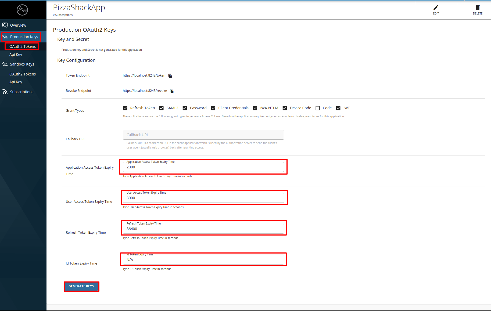

# Changing the Default Token Expiration Time

Follow the instructions below to change the default token expiry time based on your requirements.

## Changing the default token expiration time at the global-level

!!! note
    The changes that you do here will be applied only to the new applications that you create.

### Changing the default expiration time of the application access tokens

Access tokens have an expiration time, which is set to 60 minutes by default. 

Follow the instructions below to change the default expiration time of the application access tokens:

1. Open the `<API-M_HOME>/repository/conf/deployment.toml` file.
2. Add or update the `app_access_token_validity` value under the `[oauth.token_validation]` section.

    ``` toml
    [oauth.token_validation]
    app_access_token_validity = 2000
    ```

### Changing the default expiration time of user access tokens

User access tokens have an expiration time, which is set to 60 minutes by default.

Follow the instructions below to change the default expiration time of user access tokens:

1. Open the `<API-M_HOME>/repository/conf/deployment.toml` file.
2. Add or update the `user_access_token_validity` value under the `[oauth.token_validation]` section.

    ``` toml
    [oauth.token_validation]
    user_access_token_validity = 3000
    ```

### Changing the default expiration time of refresh tokens

Refresh access tokens have an expiration time, which is set to 24 hours by default.

Follow the instructions below to change the default expiration time of refresh tokens:

1. Open the `<API-M_HOME>/repository/conf/deployment.toml` file.
2. Add or update the `refresh_token_validity` value under the `[oauth.token_validation]` section.

    ``` toml
    [oauth.token_validation]
    refresh_token_validity = 86400
    ```

!!! note
    Finally, your configuration will look as follows if you have configured all the above configurations.
    ``` toml
    [oauth.token_validation]
    app_access_token_validity = 2000
    user_access_token_validity = 3000
    refresh_token_validity = 86400
    ```

## Changing the default token expiration time at the application-level

Follow the instructions below to configure the token expiration time at the application-level:

1. Sign in to the Developer Portal.  
    
     `https://<hostname>:9443/devportal`

2. Click **Application** to navigate to the applications listing page.

3. Click on the respective application for which you want to generate keys.

3. Click **Oauth2 Token** under **Production Key**, and set the validity period as follows:

     [](../../../../assets/img/learn/generate-token-with-custom-validity.png)


!!! info "More methods to optimize key validation"
    In addition, see [Configuring Caching](../../../../install-and-setup/setup/advance-configurations/configuring-caching.md) for several caching options that you can use to optimize key validation.
