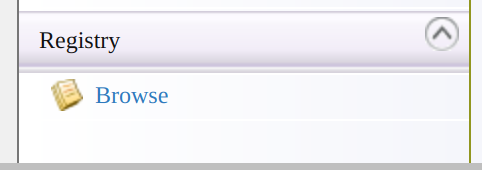
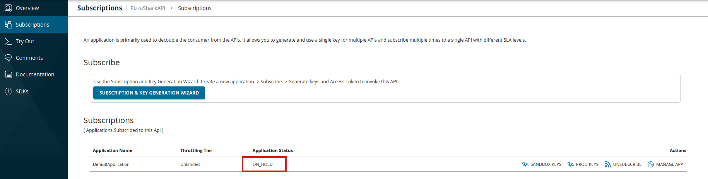
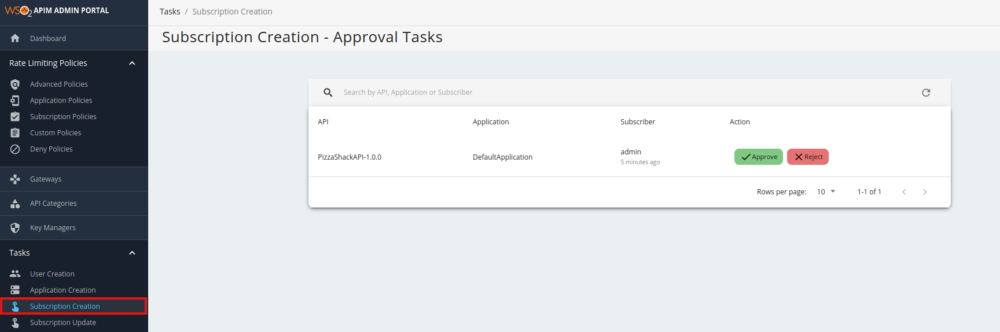
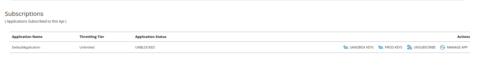
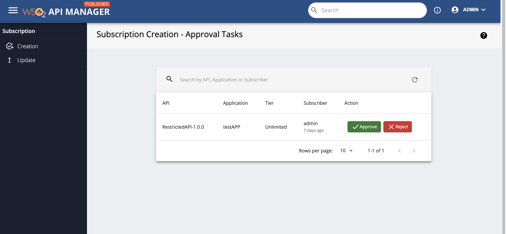

# Adding an API Subscription Workflow

This section explains how to attach a simple approval workflow to the API subscription operation in the API Manager.

Attaching a custom workflow to API subscription enables you to add throttling tiers to an API that consumers cannot choose at the time of subscribing. Only admins can set these tiers to APIs. When a consumer subscribes to an API, consumer has to subscribe to an application in order to get access to the API. However, when the API subscription workflow is enabled and the consumer subscribes to an application, initially the API subscription is in the `On Hold` state, and he/she can not use the API. The API can be invoked using the production or sandbox keys only once the subscription is approved.


#### Engaging the Approval Workflow Executor in the API Manager

First, enable the API subscription workflow for **Approval Workflow Executor.**

1.  Sign in to API Manager Management Console ( `https://<Server Host>:9443/carbon` ) and select **Browse** under **Registry** .

    

2.  Go to the `/_system/governance/apimgt/applicationdata/workflow-extensions.xml` resource, disable the Simple Workflow Executor and enable WS Workflow Executor.

     ``` 
     <WorkFlowExtensions>
        ...
        <!--SubscriptionCreation executor="org.wso2.carbon.apimgt.impl.workflow.SubscriptionCreationSimpleWorkflowExecutor"/-->
        <SubscriptionCreation executor="org.wso2.carbon.apimgt.impl.workflow.SubscriptionCreationApprovalWorkflowExecutor"/>
        ...
     </WorkFlowExtensions>
     ```

     The subscription creation Approval Workflow Executor is now engaged.

3.  Go to the API Developer Portal credentials page and subscribe to an API. If the approval workflow is enabled then after subscribing you will see the subscription status as **ON_HOLD**.

     [](../../../assets/img/learn/subscription-creation-onhold.png)

4.  Sign in to the Admin Portal ( `https://<Server Host>:9443/admin` ), list all the tasks for API subscription from **Tasks** --> **Subscription Creation** and click on  approve or reject to approve or reject workflow pending request.

    [](../../../assets/img/learn/subscription-creation-pending-list.png)

    After approving go back to the API Developer Portal credentials page, the application status will be **UNBLOCKED**.
     
    [](../../../assets/img/learn/subscription-creation-unblocked.png)

5. The subscription creation approval capability is now added into API Publisher portal as well to enable the Publishers of the API to approve/reject the subscriptions without being depended on the Admin for the above task. In order to check the subscription requests from the publisher portal Goto **Tasks** --> **Subscription** --> **Creation**.

    [](../../../assets/img/learn/subscription-creation-pending-list-in-publisher-portal.png)

6. Go back to the API Developer Portal and see that the user is now subscribed to the API.

For instructions on how to customize workflow extensions, see [Customizing a Workflow Extension](../../../reference/customize-product/extending-api-manager/extending-workflows/customizing-a-workflow-extension.md).
