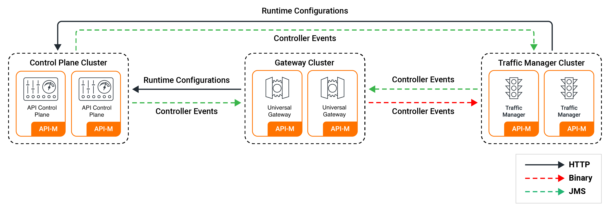

# Configuring a Distributed API-M Deployment

WSO2 API-M can be deployed as an [all-in-one deployment](../../../install-and-setup/setup/single-node/all-in-one-deployment-overview.md) or as a distributed deployment. In the distributed setup, the respective component distributions, namely WSO2 API Control Plane, WSO2 Universal Gateway and WSO2 Traffic Manager are deployed as separate nodes.

Given below are the API-M nodes you can have in a distributed deployment by default.

!!! Tip
    To enable high availability, you need a minimum of two nodes running each component distribution.

<table>
    <tr>
        <th>
            API-M Component Distribution
        </th>
        <th>
            Description
        </th>
    </tr>
    <tr>
        <td>
            WSO2 API Control Plane
        </td>
        <td>
            API-M nodes running the Control Plane component. The WSO2 API Control Plane includes the Key Manager, Publisher Portal, Developer Portal components.
        </td>
    </tr>
    <tr>
        <td>
            WSO2 Universal Gateway
        </td>
        <td>
            API-M nodes running the Gateway component.
        </td>
    </tr>
    <tr>
        <td>
            WSO2 Traffic Manager
        </td>
        <td>
            API-M nodes running the Traffic Manager component.
        </td>
    </tr>
</table>

--8<-- "api-manager/4.5.0/includes/deploy/steps-to-deploy-apim-in-a-distributed-setup-with-tm-separation.md"