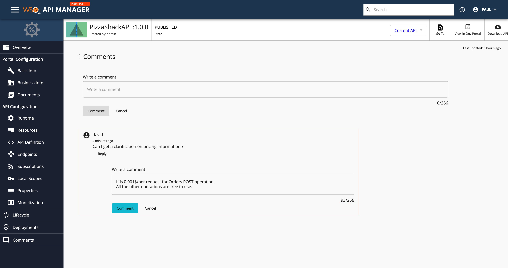

# Comment on an API via the Publisher

The Publisher portal provides several useful features to build and nurture an active community of users for your APIs. Community features help API Consumers collaborate and communicate with the API Publisher and also build up constructive conversations.

The API Publishers or API Creators can comment on any API that is available in the Publisher Portal and they can build up conversations with fellow API Publishers or API Consumers. API Publishers or API Consumers can add new comments or reply to any comment either via the Developer Portal or the Publisher Portal itself.

Follow the instructions below to comment and reply to an API:

1.  Sign in to the Publisher.

    `https://<hostname>:9443/publisher`
     
    `https://localhost:9443/publisher`

2. Click on an API.

    

3. Optionally, **Add a comment**.
    
     Type a comment and click **COMMENT**.

     Note that the comments appear sorted by the time they were entered, alongside the author's name.

    

5. Optionally, **Reply to a comment**.

     Click **REPLY**, type your reply, and click **COMMENT**.

    

     When you add a reply to a comment, it will appear in a nested format to the original or the root comment.
