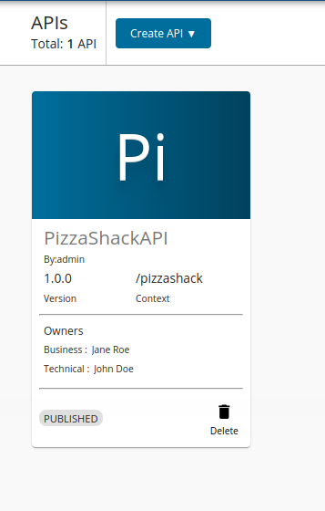
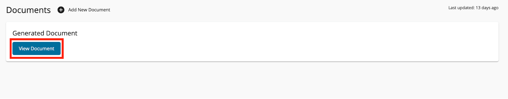
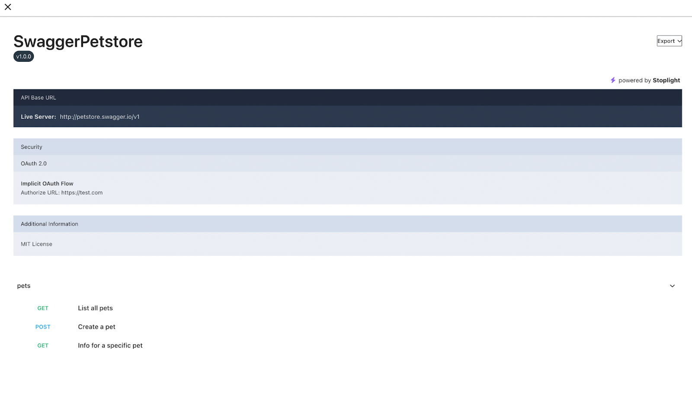

# View Generated Documentation for Rest APIs

Follow the instructions below to view the generated documentation to a REST API.
This feature does not support other API types.

1.  Sign in to the WSO2 API Publisher.
     
     `https://<hostname>:9443/publisher`

2.  Click on the API (e.g., `PizzaShackAPI 1.0.0` ) for which you want to view the documentation.
   
    [{: style="width:30%"}](../../../assets/img/learn/select-api-with-business-info.png)

3. View the generated documentation.

    1.  Click **Documents** and click **View Document** under Generated Document.
        
         

    2.  A document will be generated from the swagger document.

         
