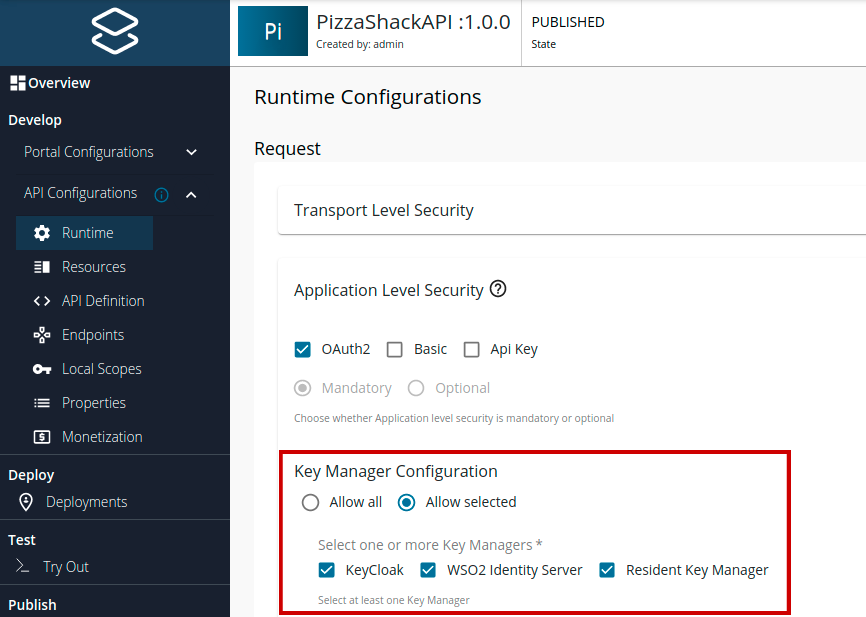
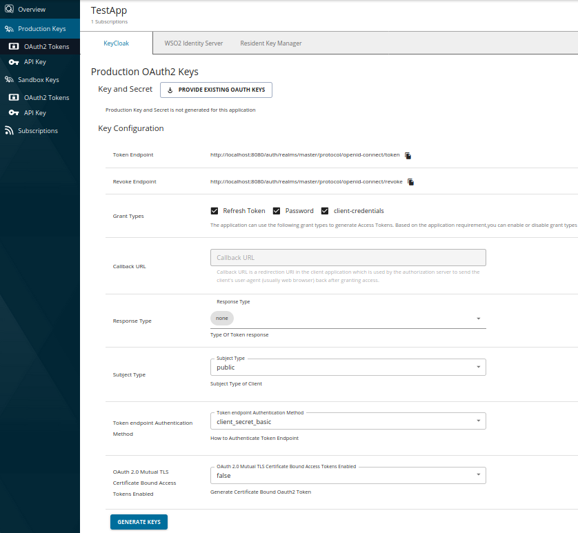

# Overview

API authentication is a way of protecting API access from unidentified or anonymous access. It ensures that the API is secured and accessible only by the consumers who proves their identity and whose identities are found within the API Management Platform. 

WSO2 API Manager offers the following authentication mechanisms to secure your API from unauthenticated access.

- [Securing APIs using OAuth2 Access Tokens](../../../../manage-apis/design/api-security/api-authentication/secure-apis-using-oauth2-tokens.md)

    - [JWT (Self Contained) Access Tokens](../../../../manage-apis/design/api-security/oauth2/access-token-types/jwt-tokens.md)
    
- [Secure APIs Using API Keys](../../../../manage-apis/design/api-security/api-authentication/secure-apis-using-api-keys.md)

- [Secure APIs Using Mutual SSL](../../../../manage-apis/design/api-security/api-authentication/secure-apis-using-mutual-ssl.md)

- [Secure APIs Using Basic Authentication](../../../../manage-apis/design/api-security/api-authentication/secure-apis-using-basic-authentication.md)

WSO2 API Manager allows you to enable multiple Key Managers for authentication.

- The tenant admin can configure preferred Key Managers via the Admin Portal console. For more information, see
[Configuring Key Managers](../../../../administer/key-managers/overview.md).

- The enabled Key Managers can be disabled for a given API via the Publisher by navigating to
**Develop -> API Configurations -> Runtime -> Application Level Security -> Key Manager Configuration**

    

- Application users are able to generate keys for an application using a preferred Key Manager as shown below.

    
