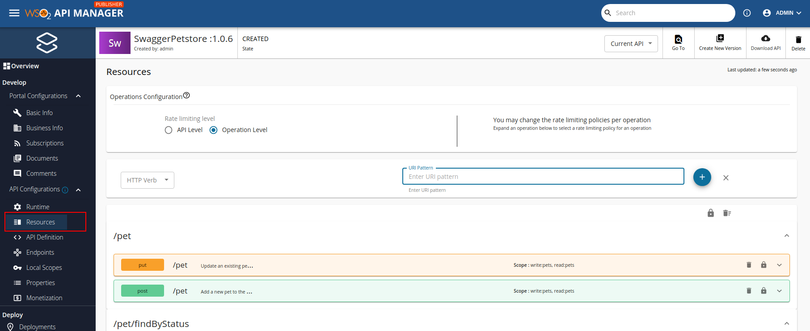
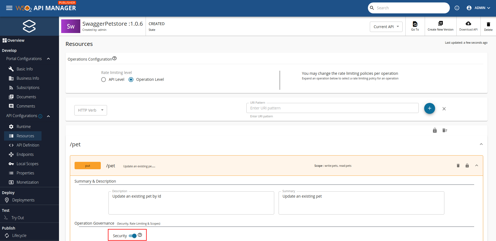
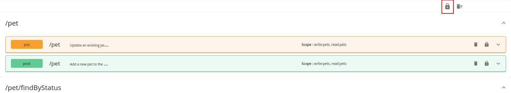

# Disabling Security for APIs

WSO2 API Manager enables OAuth 2.0 security for APIs by default. Therefore, all APIs must be invoked with an access token. You can get an access token in the following ways.

- [Get an internal test key from Publisher](../../../../manage-apis/design/create-api/create-rest-api/test-a-rest-api.md)
- [Get an access token for a subscription from Developer Portal](../../../../consume/consume-api-overview.md)

For testing purposes, you can eliminate the need of an access token by disabling security for the entire API or a specific resource.

## Disabling security for a single API resource

1. Click **Resources** listed under **API Configurations** in the left menu to navigate to the Resources page in the Publisher.

     

2. Expand any method and switch the security slidebar off to disable security for that specific resource.

     

## Disabling security for all API resources

1. Click **Resources** to navigate to the Resources page in the Publisher.

2. Click on the lock icon to disable security for all the resources that correspond to a specific API.

     