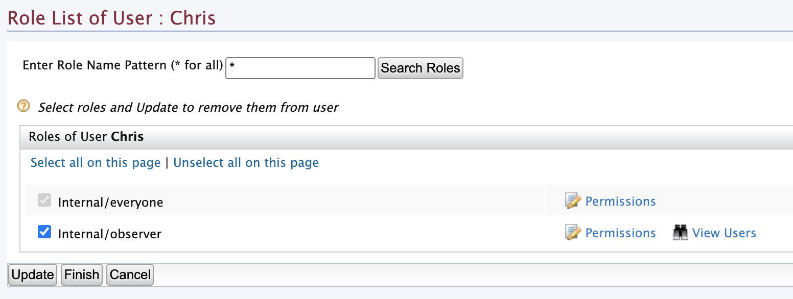
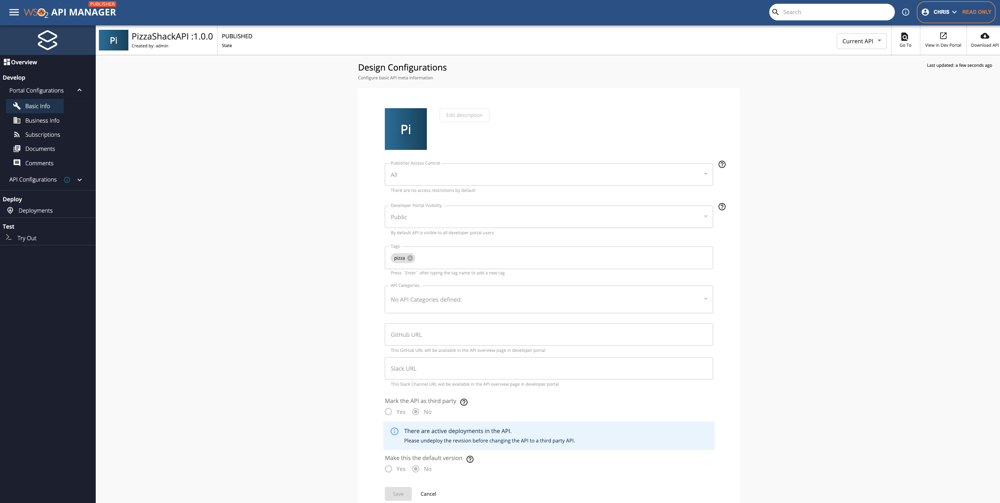

# Publisher Portal in Read-only Mode

Users who have the view/read only permissions can only view the API, API Product and Service details in the Publisher portal and in addition they can also review all the analytics related details.

The read only user should have the following scopes - `apim:api_view` and `apim:publisher_settings`

WSO2 API-M provides a pre-defined role named **internal/observer**, which is used to group all the read-only users.

## Accessing the Publisher portal in read-only mode 

Let's create a read-only user and experience the Publisher portal in read-only mode.

### Step 1 - Create a read-only user

Follow the instructions below to create a Read only user:

1. Sign in to the WSO2 Management Console (`https://<APIM_host>:<APIM_port>/carbon`) as the admin (default credentials are `admin`/`admin`).

2. Create a user (Chris) and assign the **observer** default role.

       [{: style="width:70%"}](../../../../assets/img/learn/api-security/assign-role-to-user.png)

3. Click **Finish**.

### Step 2 - Access the Publisher

When the read-only user (Chris) is logged in to the Publisher, Chris can view the Publisher portal as shown below.

Example: API detail view

