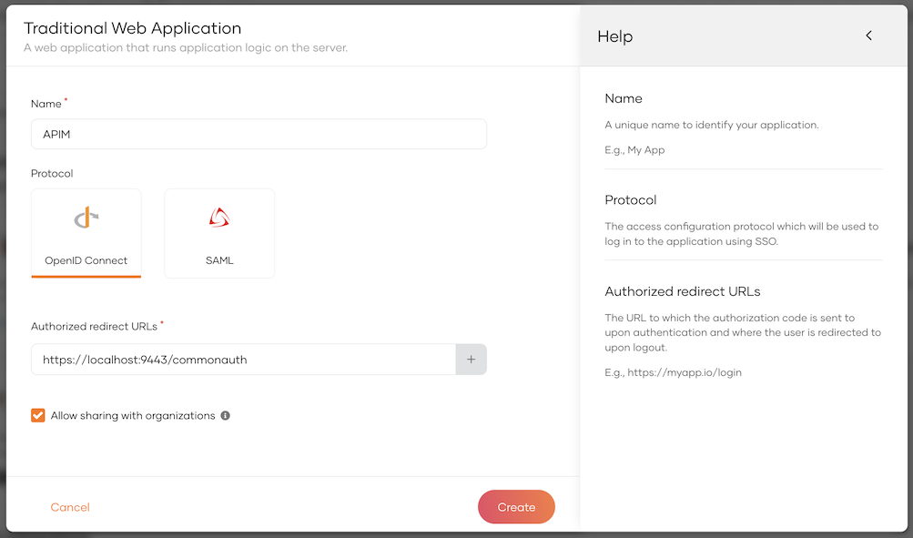
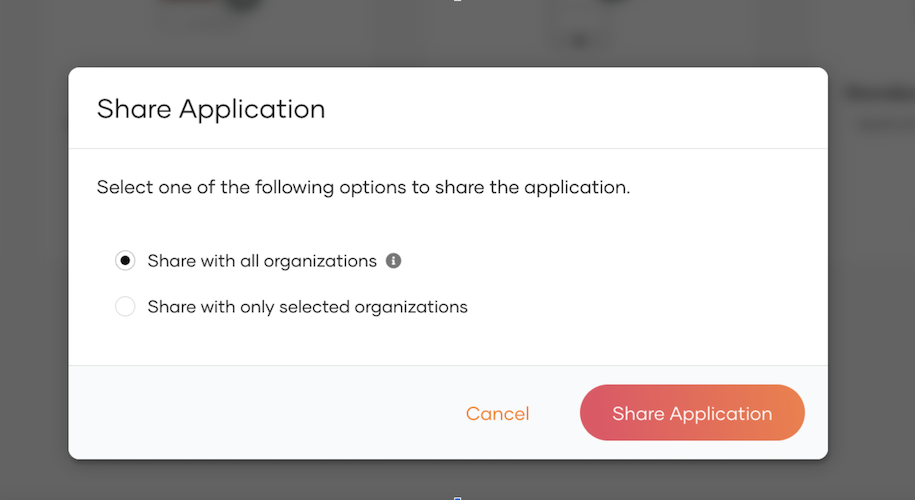
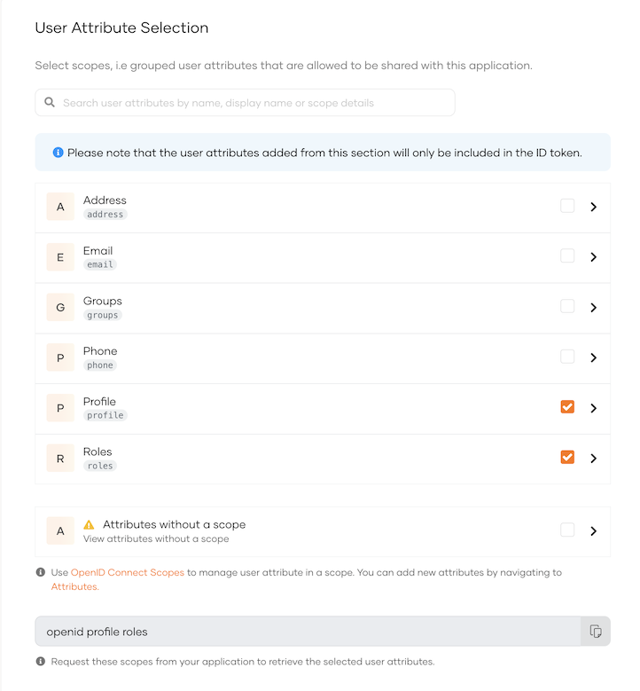
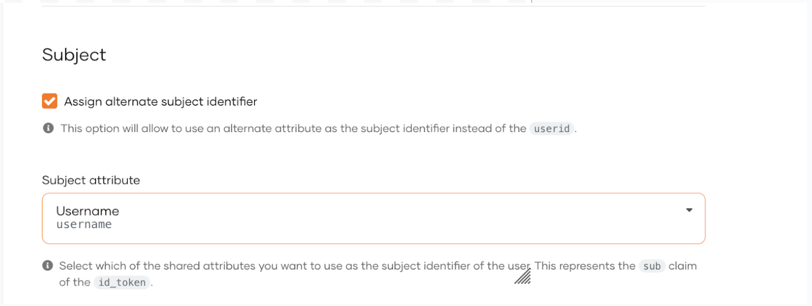
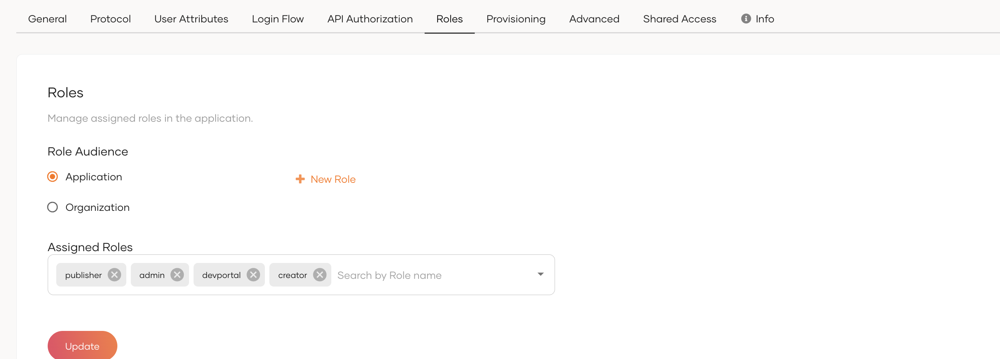
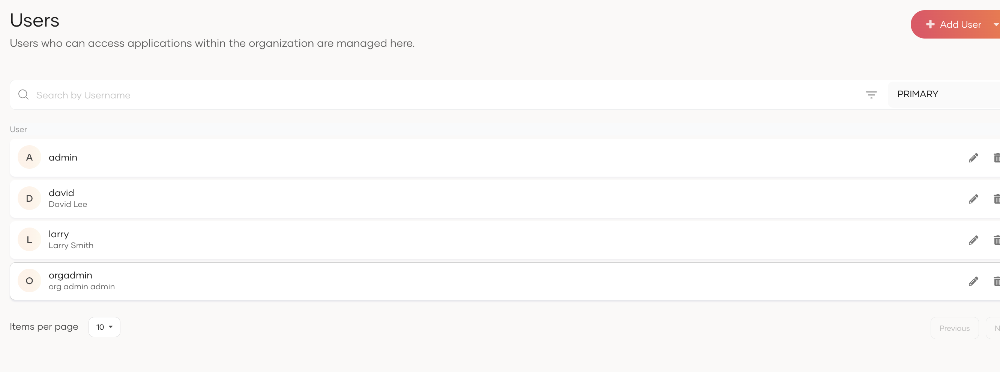
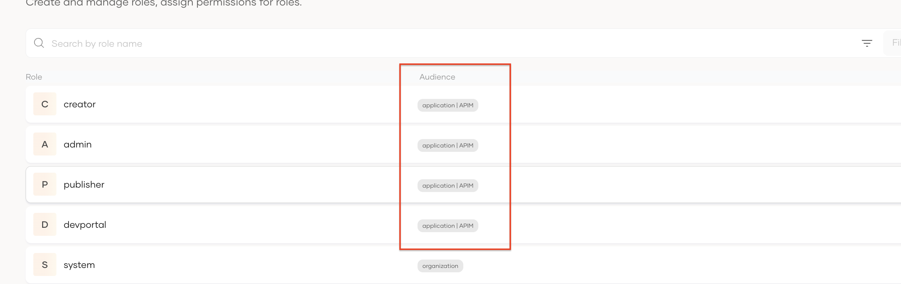
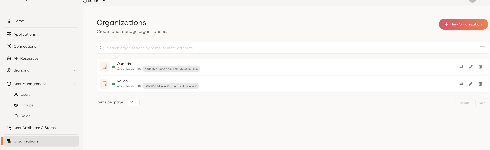
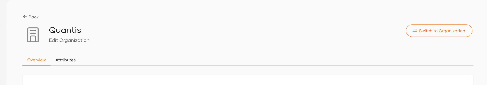
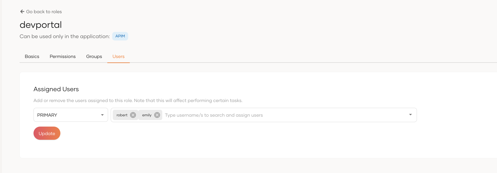

# Setup WSO2 Identity Server as a Federated Authenticator

WSO2 Identity Server 7.1.0 includes B2B organization support. The following instructions detail how to configure it as a federated authenticator for WSO2 API Manager.

## Configure WSO2 Identity Server

1. Download [WSO2 Identity Server 7.1.0](https://wso2.com/identity-server/).
2. Add following configurations in the <IS7_HOME>/repository/conf/deployment.toml file.
    ```toml
    [oauth]
    authorize_all_scopes = true

    [oauth.oidc.user_info]
    remove_internal_prefix_from_roles=true

    [[resource.access_control]]
    context="(.*)/scim2/Me"
    secure=true
    http_method="GET"
    cross_tenant=true
    permissions=[]
    scopes=[]

    [role_mgt]
    allow_system_prefix_for_role = true
    ```
3. Start WSO2 Identity Server with a port offset. Port offset is required only if you are running both API-M and IS 7.x in the same JVM.

    `sh wso2server.sh -DportOffset=1`

4. Log in to the IS Console at [https://localhost:9444/console](https://localhost:9444/console) and create a new application.
    - Select "Traditional Web Application" and complete the form.
    - Set the Redirect URL to [https://localhost:9443/commonauth](https://localhost:9443/commonauth) 

     

5. Select ‘Allow sharing with organizations’ option.

     

6. Once the application is created, go to the 'Protocol' tab and copy the Client ID and Secret for later use.
7. Go to the **User Attributes tab** and select **Roles**.

     

8. Under the **Subject sub-section**, select **Assign alternate subject identifier** and select **Username**.

     

9. Under the **Roles sub-section**, add application roles **devportal**, **publisher**, **creator**, **admin**.

     

10. Go to the **User Management** menu item, navigate to the **Users tab**, and create three users—one for each portal.

     

11. Go to the **Roles** menu item under the **User Management** menu item and assign application roles to users. (Check audience column and get the application/<application name> roles)

     

12. Select a role and go to the **Users tab** to assign users to the role.
In this example
    admin → orgadmin
    publisher, creator → larry
    devportal → david

13. Now let's create organizations. For that, select **Organization** and create a couple of new organizations. Note down the organization IDs.

     

14. Select the organization and click **Switch to Organization**.

     

15. Under the **Users** menu item in **User Management**, add a new user. Let's say `emily` and `robert`.

16. Under the **Roles** menu item in **User Management**, find the previously created `devportal` role and select it. Select the **Users tab** and set the user to this role.

     

    !!! note
        Organization restriction capability is not supported in the Admin and Publisher portals in this release. To prevent organization users from logging into these portals, do not assign them Admin or Publisher/Creator roles to the users in sub organizations.

17. Similarly, create a user in another organization and assign the developer role.
