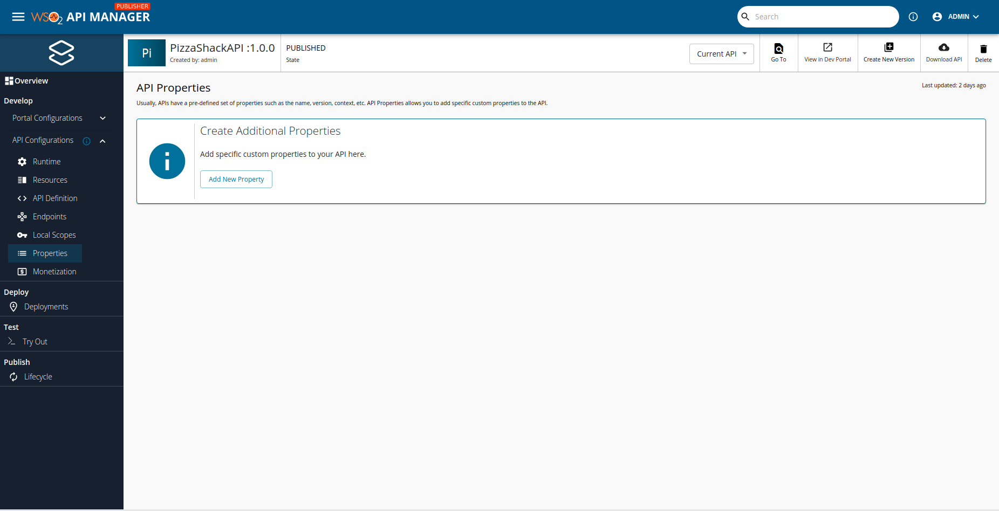
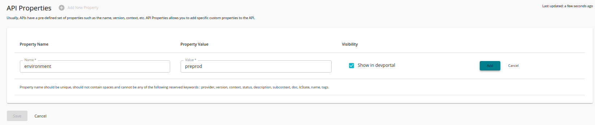
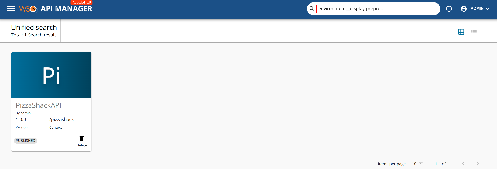
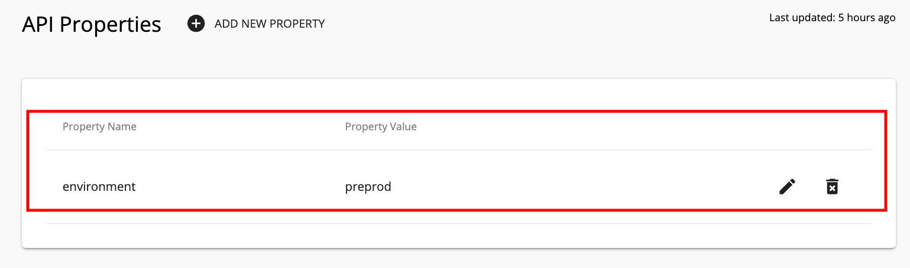

# Adding Custom Properties to APIs

Usually, APIs have a predefined set of properties such as the name, version, context, etc. However, there may be instances where you want to add specific custom properties to your API. You can do this in either of the following ways:

-   [Add custom properties via the API Publisher](#AddcustompropertiesviatheAPIPublisher)
-   [Add custom properties via the REST API](#AddcustompropertiesviatheRESTAPI)

When adding custom properties, note the following:

-   Property name should be unique.

-   Property name should not contain spaces.

-   Property name cannot be case-sensitive.

-   Property name cannot be any of the following as they are reserved keywords: provider, version, context, status, description, subcontext, doc, lcState, name, tags.

After the custom properties have been added, you can [search for APIs using custom property values](#Searchusingcustomproperties).

<a name="AddcustompropertiesviatheAPIPublisher"></a>

### Add custom properties via the API Publisher

1.  Sign in to the WSO2 API Publisher.
      
      `https://<hostname>:9443/publisher`
      
      Example: `https://localhost:9443/publisher`

2.  [Create a new API](../../../manage-apis/design/create-api/create-rest-api/create-a-rest-api.md) or edit an existing API.

3.  Click **Properties** and click **Add New Property**.

      [](../../../assets/img/learn/properties-add-property.png)

4. Enter a custom property name and value (e.g., property name: environment, property value: preprod), mark Developer Portal visibility as appropriate and click **Add** to add it.

      [](../../../assets/img/learn/add-new-property.png)

5.  Click **Save** to save the API.

<a name="AddcustompropertiesviatheRESTAPI"></a>

### Add custom properties via the REST API

Use the [existing REST API](../../../reference/product-apis/overview.md) to add a new API and in order to add the API with custom properties make sure to add the following element to the request body including the relevant properties.

```
"additionalProperties": [
      {
          "name" : "environment",
          "value" : "preprod",
          "display" : true 
      },
      {
          "name" : "secured",
          "value" : "true",
          "display" : true 
      }
    ]
```

<a name="Searchusingcustomproperties"></a>

### Search using custom properties

You can use the following format to search for an API using the custom properties:

 - If Developer Portal visibility is enabled

      `<property_name>__display:<property_value>`

 - If Developer Portal visibility is disabled

      `<property_name>:<property_value>`

For example, if you want to search for the environment property with a specific value (e.g., preprod) and if the Developer Portal visibility is enabled for that property, you can search the API in the Publisher Portal, as shown below:

[](../../../assets/img/learn/search-apis-with-custom-properties.png)

When you click on the name of the API in the above screen, the respective API Overview page appears. Click on the **Properties** tab to list the API properties that you added.

[](../../../assets/img/learn/view-custom-api-properties.png)
