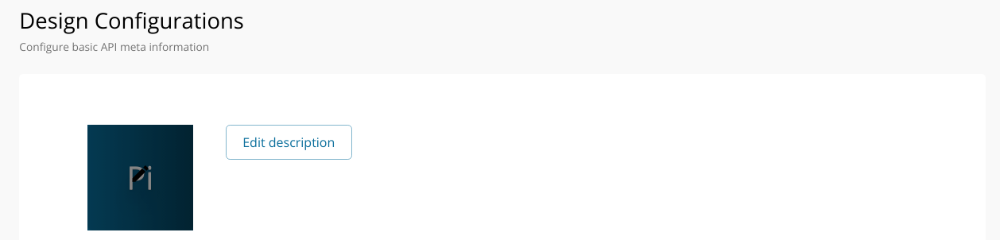
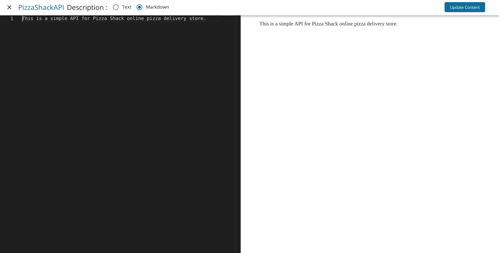
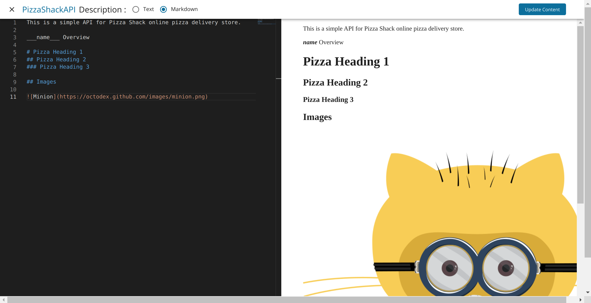
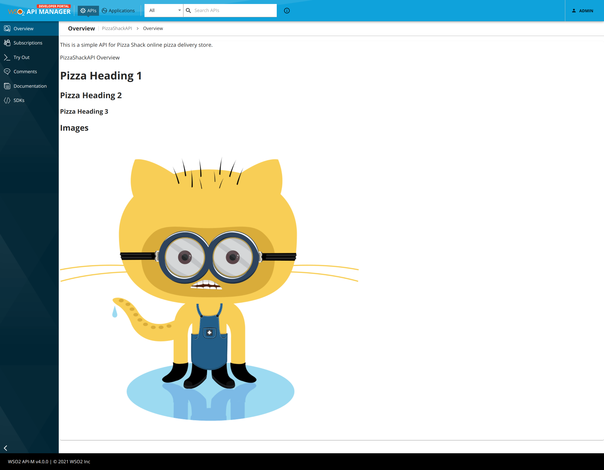

# Override API Overview page per API

It is possible to display a custom Overview content for any API by following the steps given below.

1. Login to the API Publisher and go to the `Develop` --> `Portal Configurations` -->  `Basic Info` section of the API that you want to override.

2. Click **Edit description** to open the embedded editor.
    

3. Select the **Markdown** option to switch to the Markdown editor.
    

4. Add the markdown content.

    Following keys can be used within the markdown to get some of the API properties.

    | Property Name | Key to use in markdown |
    | --- | --- |
    | name | `___name___` |
    | authorizationHeader | `___authorizationHeader___` |
    | avgRating | `___avgRating___` |
    | context | `___context___` |
    | id | `___id___` |
    | lifeCycleStatus | `___lifeCycleStatus___` |
    | provider | `___provider___` |
    | type | `___type___` |
    | version | `___version___` |

    

    Above screen demonstrates the use of `___name___` key to display API name within the markdown content.

5. Click **Update Content**. Then click **Save** at the bottom of the `Design Configurations` form.

6. Go to the Developer Portal and select the API for which the markdown content was added. Overview for the selected API will be rendered from the markdown content.

    
