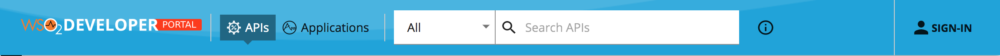
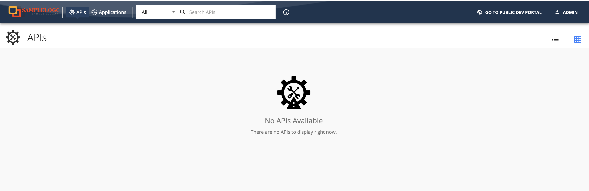

# Changing the Logo and Header Styles

The header section can be customized to match different design needs by configuring the `defaultTheme.js` file.

The `defaultTheme.js` file has all the parameters defining the look and feel of the developer portal. To learn more about `defaultTheme.js` refer [here](../../../../reference/customize-product/customizations/customizing-the-developer-portal/overriding-developer-portal-theme.md#global-theming).

The following is the default look and the configuration. The default header of the API Manager Developer Portal is shown below.

  

1. Open the `<API-M_HOME>/repository/deployment/server/webapps/devportal/site/public/theme/userTheme.json` file in a text editor and set the attributes accordingly as shown below which customizes the logo and the header of the developer portal.

    ```js
    {
        "custom": {
            "appBar": {
                "logo": "/site/public/images/logo.svg",
                "logoHeight": 19,
                "logoWidth": 208,
                "background": "#0fa2db",
                "backgroundImage": "/site/public/images/appbarBack.png",
                "searchInputBackground": "#fff",
                "searchInputActiveBackground": "#fff",
                "activeBackground": "#1c6584",
                "showSearch": true,
                "drawerWidth": 200
            }
        }
    }
    ```

    | Option | type | Description |
    | ------ | -- | ----------- |
    | logo | string | Relative path to logo |
    | logoHeight | integer | Logo height in pixels |
    | logoWidth | integer | Logo width in pixels |
    | background | string | Background color of the header |
    | backgroundImage | string | Set the background image to the header. Ex: '/site/public/images/appbarBack.png' |
    | searchInputBackground | string | Set the background color for the search input |
    | searchInputActiveBackground | string | Set the background color for the search input |
    | activeBackground | string | Background color of the selected header menu item |
    | drawerWidth | integer | Small resolutions will collopse the top menu in to a toggle drawer. This property sets the it's width in pixels |

2. Refresh the Developer Portal to view the changes.

#### Example

We can change the logo and the header background as follows by changing the parameters. An example is shown below.

```js
{
    "custom": {
        "appBar": {
            "logo": "/site/public/images/logo-black.png",
            "logoHeight": 66,
            "logoWidth": 200,
            "background": "#a10207",
            "activeBackground": "#ffd500"
        }
    }
}
```

Make sure you restart the server for the changes to take effect.

  
