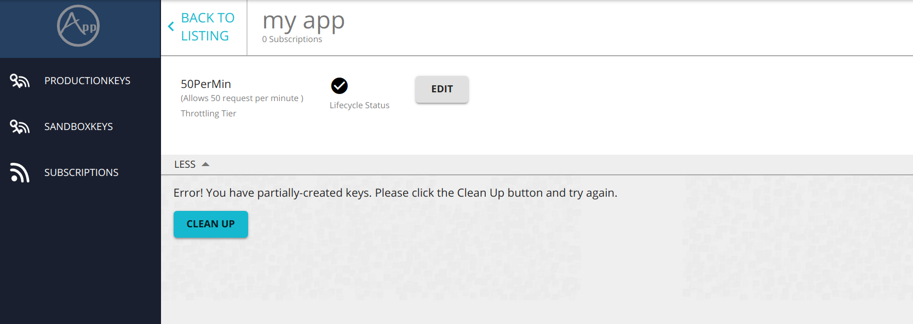

# Cleaning Up Partially Created Keys

An application created in WSO2 API Manager has a corresponding OAuth application in the Key Manager node. An application can be created or deleted partially, where the OAuth application is successfully created/deleted but there is stale data left in the API Manager node. This can happen due to network failures between the API Manager and the Key Manager nodes, partial deletion of applications, etc.

To delete the remaining application data from API Manager, follow below steps.

1. Navigate to view the application listing by clicking on the **Applications** tab in the top ribbon.
2. Click on the application name. This will show the application details.
3. Click on the **Clean up** button found at the bottom of the page.

