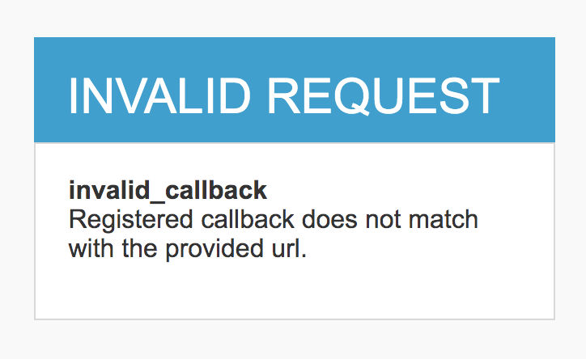
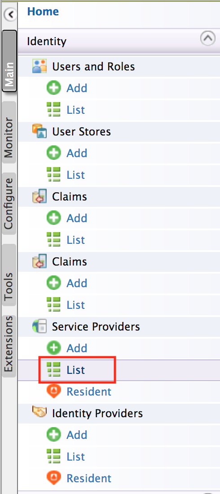
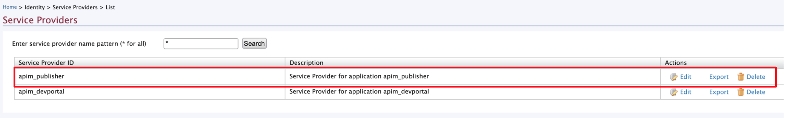
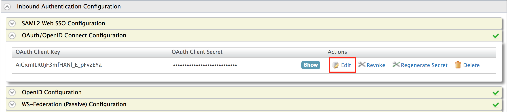

# Troubleshooting 'Registered callback does not match with the provided URL' error

The **Registered callback does not match with the provided URL** error can be encountered during the API Publisher(`https://<hostname>:9443/publisher`) and API Developer Portal (`https://<hostname>:9443/devportal`) login attempts, in a case where the hostname of the API Manager has been changed after accessing the Developer Portal or Publisher apps via different hostnames. 

For example, let's assume that you have started a fresh APIM server and accessed the API Publisher and Developer Portal apps via localhost. If you have [changed the hostname](../install-and-setup/setup/deployment-best-practices/changing-the-hostname.md) of the server from `localhost` to `apim.wso2.com`, the next login attempt to API Publisher or Developer Portal will be failed giving this error.

<a href="../assets/img/troubleshooting/invalid-callback-url-error.png" ></a> 
          
This error has been occurred due to the mismatch of the API Publisher or API Developer Portal access URLs((`https://<hostname>:9443/publisher` and `https://<hostname>:9443/devportal`)  and callback URLs which are configured in API Publisher and API Developer Portal Service Providers.
 
Please follow below steps to fix the login failure due to callback URL mismatch.

1.  Sign in to the Management Console (`https://<hostname>:9443/carbon`).
2.  Navigate to service providers list.

    <a href="../assets/img/troubleshooting/service-providers.png" ></a> 

3.  Click on the **Edit** button of API Publisher service provider

    <a href="../assets/img/troubleshooting/service-providers-list.png" ></a> 

4.  Navigate to  **Inbound Authentication Configuration > OAuth/OpenID Connect Configuration** and click on OAuth application edit button.

    <a href="../assets/img/troubleshooting/oauth-app-select.png" ></a>    
          
5.  See the **Callback Url** regex value configured under Application Settings. You will observe that the callback URL value is having a different hostname(`localhost` or previous hostname which was configured before the hostname change). 
    
    ```
    regexp=(https://localhost:9443/publisher/services/auth/callback/login|https://localhost:9443/publisher/services/auth/callback/logout)
    ``` 

    Then replace the callback URL hostname with the current hostname of the server. For example, if the current hostname of the server is `apim.wso2.com`, the callback URL regex has to be changes as follows.
    
    ```
    regexp=(https://apim.wso2.com:9443/publisher/services/auth/callback/login|https://apim.wso2.com:9443/publisher/services/auth/callback/logout)
    ```     

6.  Click on **Update** button in Applications Settings page, then the **Update** button of service provider information page to save the callback URL change.

7.  Select the service provider for API Developer Portal (`admin_admin_store`) and repeat the step 4 - step 6 to apply the same changes.
