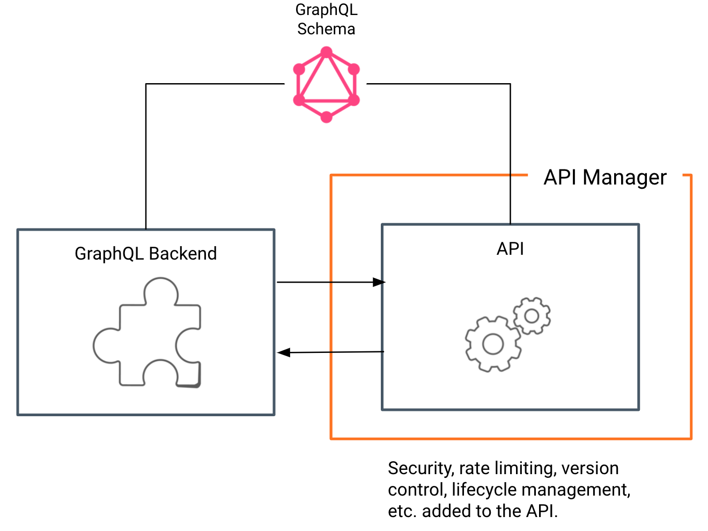
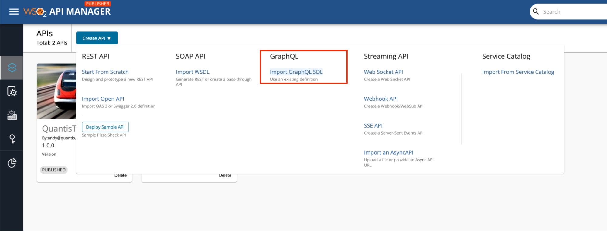
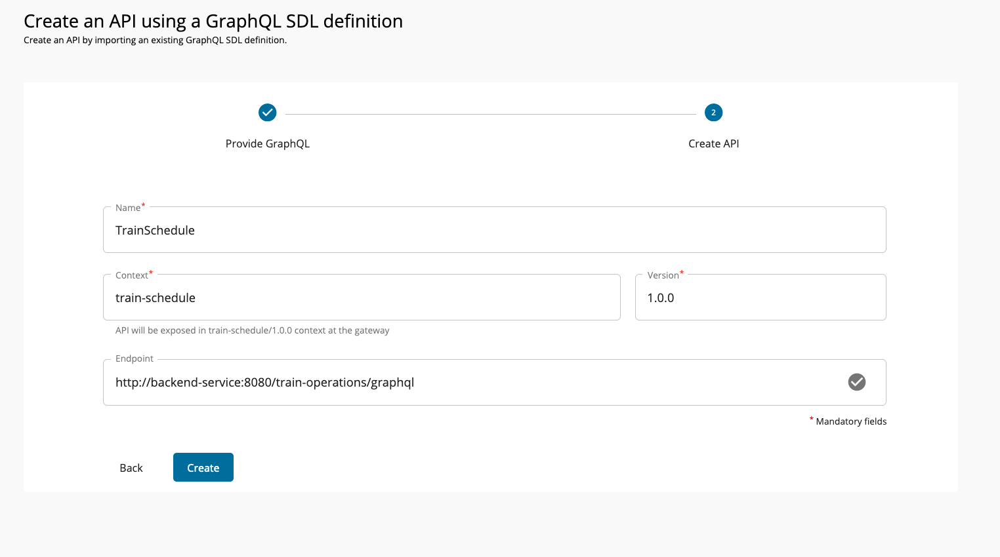
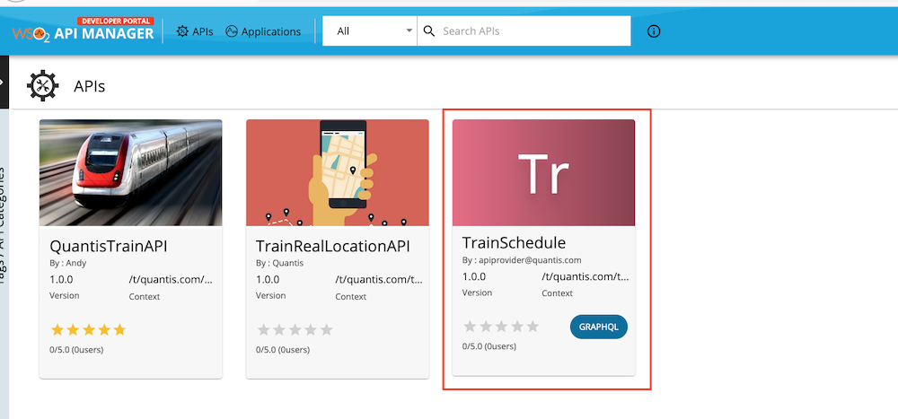
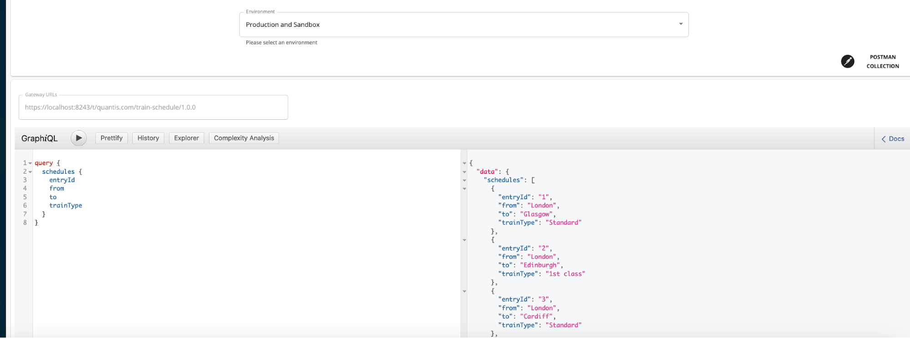

# Scenario 11 - GraphQL Support

This is a tutorial that is part of a series and can be used as a standalone tutorial on how to work with GraphQL. For more details on the scenario and general prerequisites, please see [the scenario overview page](../../tutorials/scenarios/scenario-overview.md).

**_Time to Complete : 5 minutes_**

## User story

Quantis is more focused on providing more capability to the developer community. They expect the developer community to build their own mobile applications and web apps to use their APIs. To make this process much easier, Quantis wants to expose GraphQL API to the public.



## Step 1: Create a GraphQL API

WSO2 API Manager supports creating GraphQL APIs using the GraphQL schema. Following steps can be used to create a sample API.

1. Log in to Publisher Portal [https://localhost:9443/publisher](https://localhost:9443/publisher) using `apiprovider@quantis.com` and password `user123`.
2. Select **Create API → Import GraphQL SDL**

    

3. Import the **train.graphql** in the **/resources** and create the API. Use `http://backend-service:8080/train-operations/graphql` as the backend endpoint URL.

    

## Step 2: Publish and test the API

1. Deploy the API and publish it. 
2. Go to the Developer Portal and navigate to the Quantis tenant domain. You will see the GraphQL API in the Developer Portal.

    
3. Log in to the Quantis Developer Portal using `bob@quantis.com` with password `user123` and subscribe to the GraphQL API using an application and get the access token.
4. You could use the **Try out** tab to try out this GraphQL API. Following is a sample request payload.

```
  schedules {
    entryId
    from
    to
    trainType 
  }
}
```

You receive a response as shown below.



## What's next

Try out the next scenario in the series, [Message Delivery](../../tutorials/scenarios/scenario12-message-delivery.md).