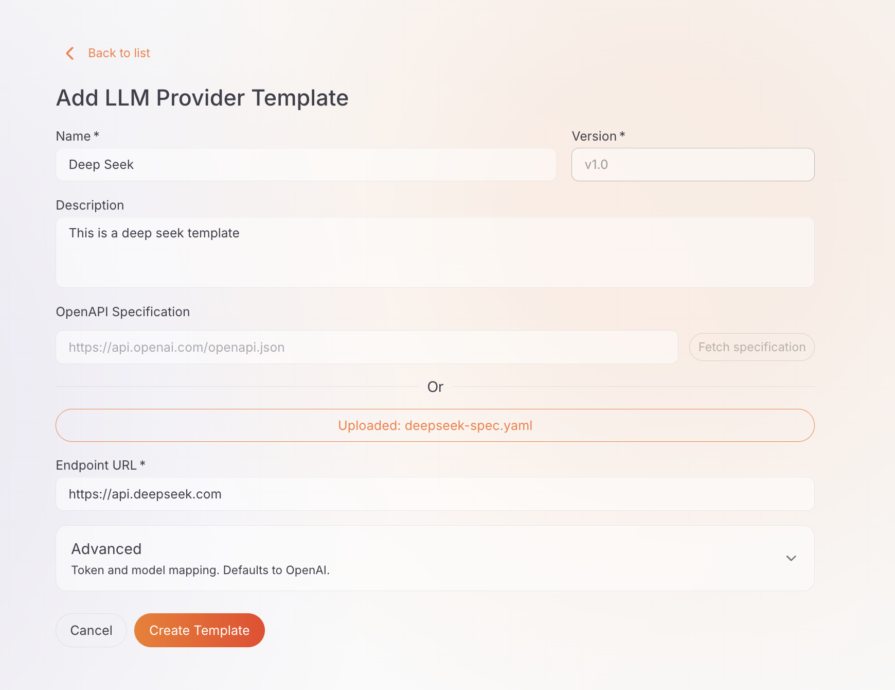
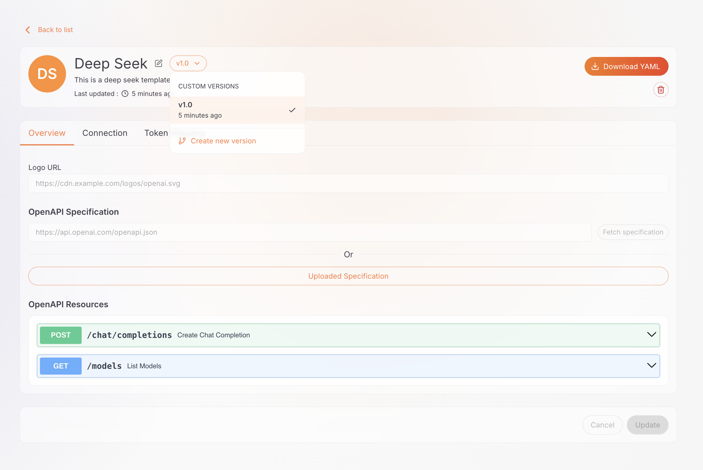
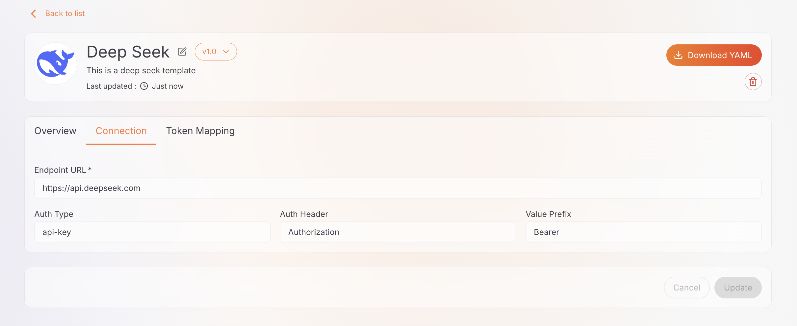
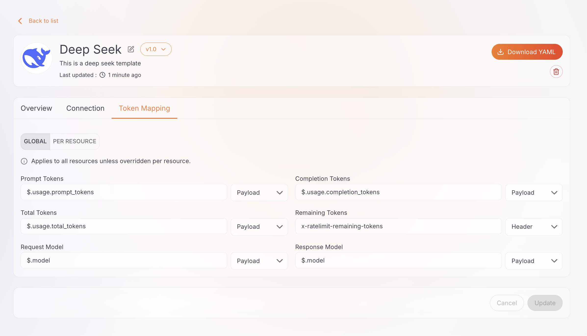
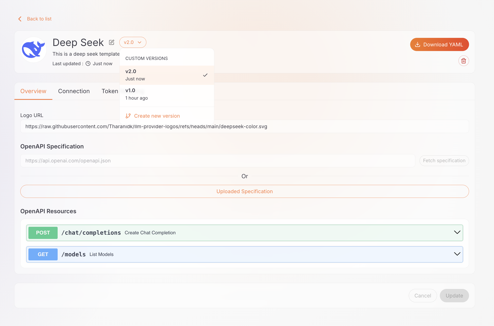

# Configure LLM Provider Template

When the built-in templates do not cover the upstream LLM service you want to use, you can create a custom template for it. This guide shows how to create a custom template, complete its configuration, manage its versions, and deploy it to a gateway.

## Prerequisites

- Access to API Platform Console with the **Admin** role
- At least one [AI Gateway created and set up](../ai-gateways/setting-up.md)
- The endpoint URL and OpenAPI specification of the upstream service

## Create a Custom Template

1. Navigate to **AI Workspace** > **Settings** > **LLM Provider Templates**.
2. Click **Create**.
3. Enter the relevant details, including the template **name** and the upstream **endpoint URL** (e.g., `https://api.example.com`).
4. Click **Create**.

The new template starts at version **v1.0**. Open it to complete the rest of the configuration.

## Configure the Template

The template details page has an overview, a version selector, and the tabs described below.

### Overview

Shows the template's logo, description, current version, and when it was last updated. For custom templates, you can edit details such as the logo URL and description here. From here you can also:

- **Download YAML**: export the current version as a manifest you can apply to a gateway.
- **Enable / Disable** the current version (built-in templates only).
- **Delete** the current version (custom templates only).

### Connection

Configure how the gateway connects to the upstream service:

- **Endpoint URL**: the base URL of the upstream service.
- **OpenAPI specification**: provide a **URL** and click **Fetch** to load it, or **upload** the file.
- **Authentication**: the inbound auth type, header or parameter name, and value prefix.

### Token Mapping

Define where token usage and model information are read from in requests and responses:

- **Default (Global) mappings**: prompt, completion, total, and remaining tokens, plus the request and response model.
- **Per-resource overrides**: different mappings for individual API resources.

## Versioning

Built-in template versions are read-only. Custom template versions can be changed at any time: edit a version in place, or create a new version to introduce a different configuration while keeping the existing version available. Either way, providers already created from a version are not affected — a provider copies the template configuration at creation time.

**To create a new version:**

1. Open the template and click the **version selector** (e.g., **v1.0**).
2. Click **Create new version**.
3. Enter the new version (e.g., `v2.0`) and adjust the configuration as needed.
4. Click **Create**.

!!! note
    Creating a new version of a **built-in** template produces a **custom** version.

## Deploy a Custom Template to the Gateway

Built-in templates are already available on the gateway, but a custom template has to be deployed manually:

1. Open the template's **Overview** tab and click **Download YAML**.
2. Apply the downloaded manifest to the target gateway.

!!! warning "Required Step"
    A provider created from a custom template only works after the template is deployed to the gateway that serves the provider.

!!! info
    You can apply the template manifest through the gateway's management API. See the [LLM Provider Template Management API reference](../../../api-gateway/next/gateway-controller-management-api/llm-provider-template-management.md) for details.

---

## Next Steps

- [Manage Template](manage-template.md) - Use templates to create providers, and edit, enable/disable, or delete templates
- [Configure LLM Provider](../llm-providers/configure-provider.md) - Create a provider from your template
