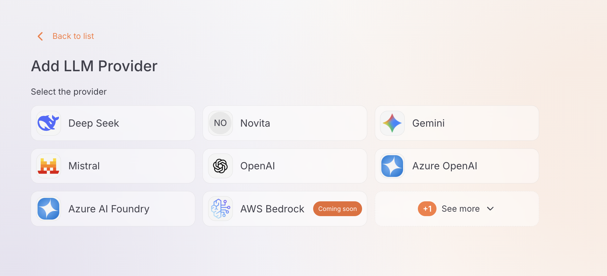
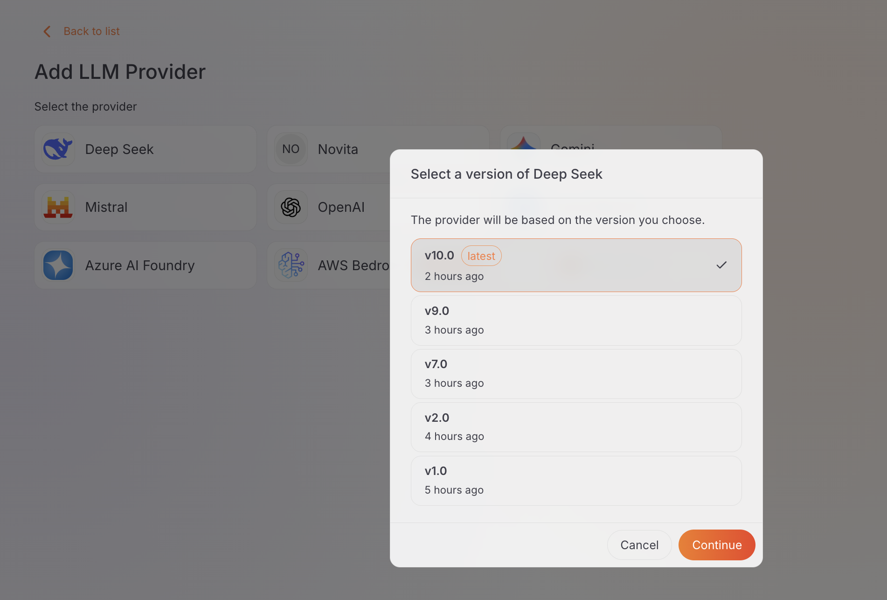
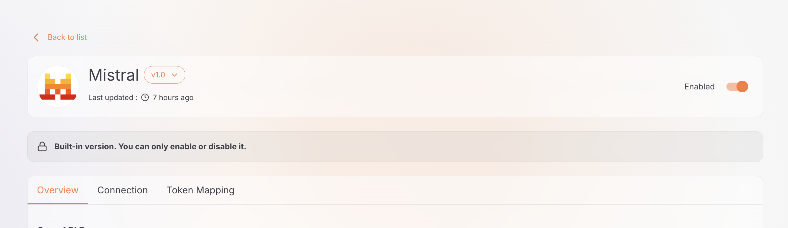
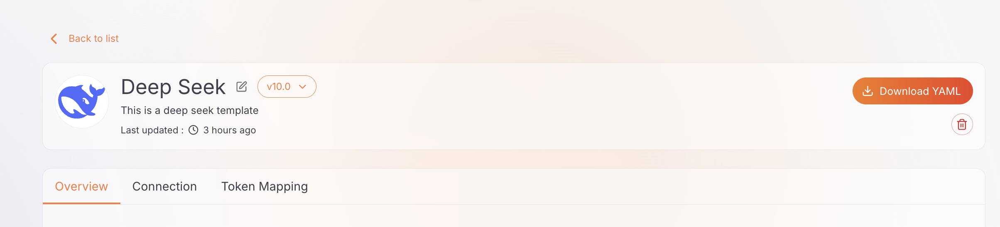

# Manage LLM Provider Template

This guide shows how to create an LLM provider from a template, and how to edit, enable or disable, and delete templates.

## Use a Template to Create a Provider

When [adding an LLM Provider](../llm-providers/configure-provider.md):

1. Pick a template from the template picker. Custom templates appear alongside the built-in ones.

    

2. If the template has more than one version, select the version you want and click **Continue**. If there is only one version, it is selected for you.

    

3. Enter the provider name and credentials. The provider takes its endpoint, authentication, and token mappings from the selected template version.

!!! warning
    A provider created from a custom template only works after the template is [deployed to the gateway](configure-template.md#deploy-a-custom-template-to-the-gateway) that serves the provider.

## Edit a Template

You can only edit **custom** templates; built-in templates are read-only. There are two ways to make a change:

- Edit a version in place through the [Overview, Connection, and Token Mapping tabs](configure-template.md#configure-the-template) — for example, to update the logo URL, endpoint, or mappings.
- [Create a new version](configure-template.md#versioning) to introduce a different configuration while keeping the existing version available.

Editing a template version does not affect the providers already created from it — a provider copies the template configuration at creation time, so template changes only apply to providers created afterwards.

## Enable / Disable a Template

You can turn a **built-in** template version on or off from the template's **Overview** tab.

- Only built-in templates can be enabled or disabled. To remove a custom template, delete it instead.
- A version cannot be disabled while a provider is using it.
- Disabled templates appear dimmed in the listing and cannot be used to create new providers.

## Delete a Template

To remove a **custom** template version:

1. Navigate to **Settings** > **LLM Provider Templates** and open the template.
2. Pick the version you want to remove from the **version selector**.
3. Click **Delete** and confirm.

!!! warning "Deletion is blocked while in use"
    You cannot delete a template version while a provider created from it still exists. The console shows the error `Cannot delete: one or more providers were created from this template.` Delete those providers first, then try again.

Deleting the last remaining version removes the whole template.

---

## Next Steps

- [LLM Providers](../llm-providers/overview.md) - Create a provider from a template
- [App LLM Proxies](../llm-proxies/overview.md) - Application-facing endpoints on top of a provider
