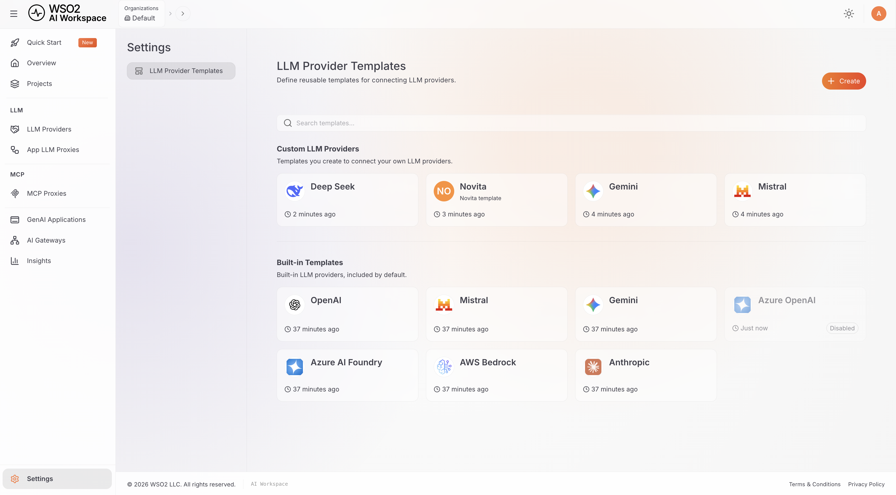

# LLM Provider Templates Overview

An LLM Provider Template is a reusable blueprint that holds everything needed to connect to an upstream LLM service:

- The upstream **endpoint URL**
- The **inbound authentication** settings (auth type, header or parameter name, and value prefix)
- The provider's **OpenAPI specification**
- The **token and model mappings** used for usage tracking

Once a template holds this configuration, you can create any number of [LLM Providers](../llm-providers/overview.md) from it without entering the same details again.

## Template Types

| Type | Description |
|------|-------------|
| **Built-in** | Shipped with the product for well-known services: OpenAI, Azure OpenAI, Azure AI Foundry, AWS Bedrock, Anthropic, Mistral, and Gemini. These are read-only; you can only enable or disable them. |
| **Custom** | Created by you, either from scratch or as a new version of a built-in template. You can edit and delete these freely. |

## Viewing Templates

1. Navigate to **AI Workspace** in your API Platform dashboard.
2. Go to **Settings** > **LLM Provider Templates**.

Custom and built-in templates appear in separate sections, and each template card shows its latest version. Disabled templates appear dimmed.

**Next:** [Configure LLM Provider Template](configure-template.md) - Create a custom template, configure it, and deploy it to a gateway
